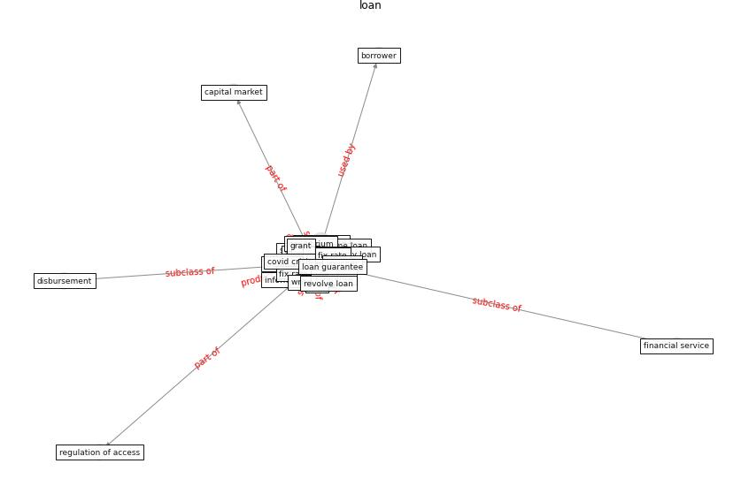

# Keyword: __loan__
## Clusters

* Cluster 9: [resilience-infrastructure](cluster_9.md)

## Concepts

 

## Articles
* eurofund_sustainable_2016-1100 ([eurofund_sustainable_2016-1100](article_eurofund_sustainable_2016-1100.md))
* COVID-19 and regional solutions for mitigating the risk
of SME finance in selected ASEAN member states ([taghizadeh-hesary_covid-19_2022](article_taghizadeh-hesary_covid-19_2022.md))
* COVID-19 and regional solutions for mitigating the risk
of SME finance in selected ASEAN member states ([taghizadeh-hesary_covid-19_2022](article_taghizadeh-hesary_covid-19_2022.md))
* world_bank_world_2022-300 ([world_bank_world_2022-300](article_world_bank_world_2022-300.md))
* Blockchain technology and its applications to combat
COVID-19 pandemic ([sharma_blockchain_2022](article_sharma_blockchain_2022.md))
* unesco_case_2021-50 ([unesco_case_2021-50](article_unesco_case_2021-50.md))
* realdania_refleksioner_2022_EN-1550 ([realdania_refleksioner_2022_EN-1550](article_realdania_refleksioner_2022_EN-1550.md))
* COVID-19 and regional solutions for mitigating the risk
of SME finance in selected ASEAN member states ([taghizadeh-hesary_covid-19_2022](article_taghizadeh-hesary_covid-19_2022.md))
* realdania_refleksioner_2022_EN-1600 ([realdania_refleksioner_2022_EN-1600](article_realdania_refleksioner_2022_EN-1600.md))
* Borders and Catastrophe: lessons from COVID-19 for the
European Green Deal ([klein_borders_2021](article_klein_borders_2021.md))
