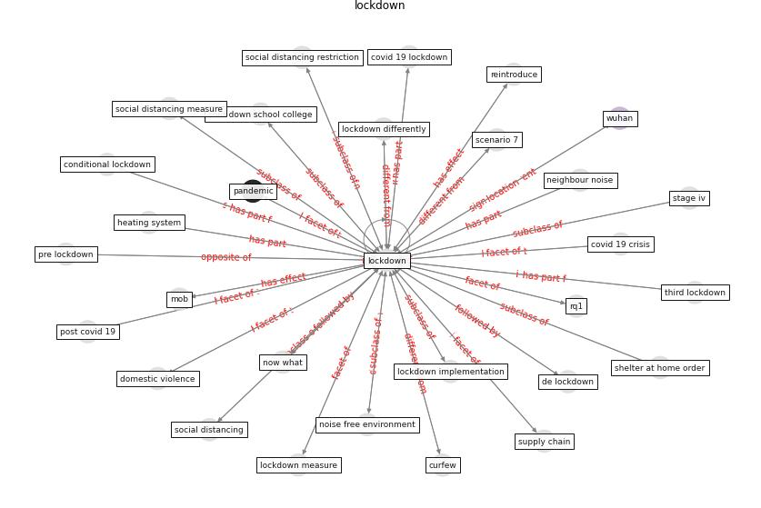

# Keyword: __lockdown__

## Concepts

 

## Top articles for __lockdown__
* Leveraging Digital Transformation Technologies to
Tackle COVID-19: Proposing a Privacy-First
Holistic Framework ([arpaci_leveraging_2021](article_arpaci_leveraging_2021))
* yan_10_2020 ([yan_10_2020](article_yan_10_2020))
* Home garden use during COVID-19: Associations with
physical and mental wellbeing in older adults ([corley_home_2021](article_corley_home_2021))
* A Mixed Approach on Resilience of Spanish
Dwellings and Households during COVID-19 Lockdown ([cuerdo-vilches_mixed_2020](article_cuerdo-vilches_mixed_2020))
* Covid-19 Associated Risks and Mitigation
Strategies relevant for the UK Construction
Industry ([dan-jumbo_covid-19_2021](article_dan-jumbo_covid-19_2021))
* What our response to the COVID-19 pandemic tells us of
our capacity to respond to climate change ([gemenne_what_2020](article_gemenne_what_2020))
* Addressing the impact of COVID-19 lockdown on energy use
in municipal buildings: A case study in Florianópolis,
Brazil ([geraldi_addressing_2021](article_geraldi_addressing_2021))
* Smart cities and a data-driven response to COVID-19 ([james_smart_2020](article_james_smart_2020))
* The changes in the effects of social media use of
Cypriots due to COVID-19 pandemic ([kaya_changes_2020](article_kaya_changes_2020))
* Attitudes towards outdoor and neighbour noise during the
COVID-19 lockdown: A case study in London ([lee_attitudes_2021](article_lee_attitudes_2021))
* yan_10_2020 ([yan_10_2020](article_yan_10_2020))
* Nurture to nature via COVID-19, a self-regenerating
environmental strategy of environment in global context ([paital_nurture_2020](article_paital_nurture_2020))
* COVID-19 and social inequalities: a complex and dynamic
interaction ([quantin_covid-19_2022](article_quantin_covid-19_2022))
* COVID-ABS: An agent-based model of COVID-19
epidemic to simulate health and economic effects of social
distancing interventions ([silva_covid-abs_2020](article_silva_covid-abs_2020))
* Association between indoor-outdoor green features and
psychological health during the COVID-19 lockdown in
Italy: A cross-sectional nationwide study ([spano_association_2021](article_spano_association_2021))
* How is COVID-19 Experience Transforming
Sustainability Requirements of Residential
Buildings? A Review ([tokazhanov_how_2020](article_tokazhanov_how_2020))
* Emerging Technologies to Combat the COVID-19
Pandemic ([vaishya_emerging_2020](article_vaishya_emerging_2020))
* The Smart City and Covid‐19 ([webb_smart_2020](article_webb_smart_2020))
