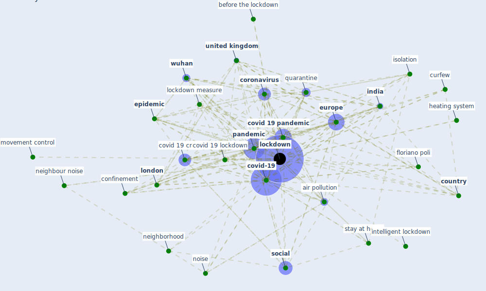

# Keyword: lockdown

* [space-housing](cluster_4)

## Keywords

 * [air pollution](keyword_air_pollution), annoyance rating, anova test, [barcelona](keyword_barcelona), baseline scenario, before the lockdown, business continuity, [confinement](keyword_confinement), cook at home, [coronavirus](keyword_coronavirus), coronavirus lockdown, [country](keyword_country), [covid 19 crisis](keyword_covid_19_crisis), covid 19 lockdown, covid 19 outbreak, [covid 19 pandemic](keyword_covid_19_pandemic), covid 19 pandemic lockdown, [covid-19](keyword_covid-19), curfew, curtail the spread of the disease, daily habit, de lockdown, [depressive symptom](keyword_depressive_symptom), domestic violence, [epidemic](keyword_epidemic), [europe](keyword_europe), face mask, facemask, [floriano poli](keyword_floriano_poli), frequency, [government](keyword_government), heating system, home perception, homequarantine, [immunity](keyword_immunity), [india](keyword_india), infection curve, [infection prevention and control](keyword_infection_prevention_and_control), [infectious disease](keyword_infectious_disease), intelligent lockdown, ipv, isolation, isolation measure, life preservation, lock down, [lockdown](keyword_lockdown), lockdown differently, lockdown ease, lockdown implementation, lockdown measure, lockdown period, lockdown status, lockdown week, [london](keyword_london), madrid, [malaysia](keyword_malaysia), mob, movement control, [neighborhood](keyword_neighborhood), [neighbour noise](keyword_neighbour_noise), [noise](keyword_noise), noise annoyance rating, noise free environment, noise level, [noise source](keyword_noise_source), non contact, non contact way, outbreak of the epidemic, [pandemic](keyword_pandemic), pandemic stricken, [peru](keyword_peru), [podgorica](keyword_podgorica), [pollution](keyword_pollution), post covid 19, pre lockdown, preventive measure, [quarantine](keyword_quarantine), rq1, [safety](keyword_safety), safety measure, secondary infection, shelter at home order, shut down school college, sleep quality, [smart](keyword_smart), [social](keyword_social), socialize, [spain](keyword_spain), stay at home, stay at home order, stay home measure, [suppression](keyword_suppression), trans portation, tunisia, [united kingdom](keyword_united_kingdom), [ventilation](keyword_ventilation), work from home policy, [wuhan](keyword_wuhan), yes no relaxing in garden, first phase

## Mapping

## Neighbours

### Closest articles

* Attitudes towards outdoor and neighbour noise during the COVID-19 lockdown: A case study in London - [LINK](article_lee_attitudes_2021)
* A Mixed Approach on Resilience of Spanish Dwellings and Households during COVID-19 Lockdown - [LINK](article_cuerdo-vilches_mixed_2020)
* Nurture to nature via COVID-19, a self-regenerating environmental strategy of environment in global context - [LINK](article_paital_nurture_2020)
* Addressing the impact of COVID-19 lockdown on energy use in municipal buildings: A case study in Florianópolis, Brazil - [LINK](article_geraldi_addressing_2021)
* Dangerous liaisons? Applying the social harm perspective to the social inequality, housing and health trifecta during the Covid-19 pandemic - [LINK](article_gurney_dangerous_2021)
* A Comprehensive Review of the COVID-19 Pandemic and the Role of IoT, Drones, AI, Blockchain, and 5G in Managing its Impact - [LINK](article_chamola_comprehensive_2020)
* COVID-ABS: An agent-based model of COVID-19 epidemic to simulate health and economic effects of social distancing interventions - [LINK](article_silva_covid-abs_2020)
* How COVID-19 Could Accelerate the Adoption of New Retail Technologies and Enhance the (E-)Servicescape - [LINK](article_willems_how_2021)
* Towards Resilient Residential Buildings and Neighborhoods in Light of COVID-19 Pandemic—The Scenario of Podgorica, Montenegro - [LINK](article_bojovic_towards_2022)
* How the 5G Enabled the COVID-19 Pandemic Prevention and Control: Materiality, Affordance, and (De-)Spatialization - [LINK](article_li_how_2022)

### Closest BPs

