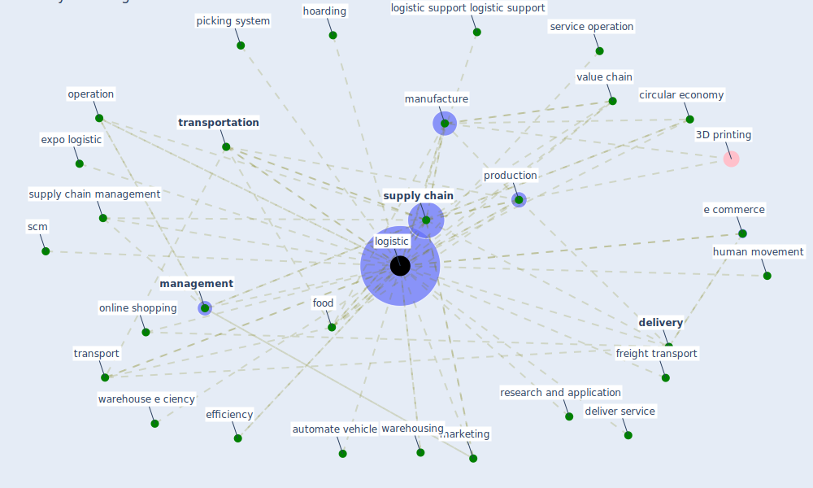

# Keyword: logistic

## Keywords

 * 7 circle, amazon, [application](keyword_application), automate vehicle, [circular economy](keyword_circular_economy), cold chain, decision support, deliver service, [delivery](keyword_delivery), e commerce, [economy](keyword_economy), expo logistic, efficiency, food, food supply chain, food system, freight transport, freight transportation, hoarding, hoarding of supply, human movement, impact of covid 19, in cabin, in cabin analytic, [industry](keyword_industry), [infrastructure](keyword_infrastructure), linkfunction, [logistic](keyword_logistic), logistic support logistic support, logistics, [management](keyword_management), [manufacture](keyword_manufacture), [marketing](keyword_marketing), online shopping, operation, order and inventory management, [physical](keyword_physical), picking system, production, [research](keyword_research), research and application, scm, scm operation, [sector](keyword_sector), service business, service operation, [shop](keyword_shop), [site](keyword_site), smart health, [supply chain](keyword_supply_chain), [supply chain management](keyword_supply_chain_management), traceable, [transport](keyword_transport), [transportation](keyword_transportation), transportation research part e, urban consolidation centre, urban freight transport, value chain, warehouse, warehouse e ciency, warehousing, xpo connect, xpo logistic

## Mapping

## Neighbours

### Closest articles

* Mapping research in logistics and supply chain management during COVID-19 pandemic - [LINK](article_montoya-torres_mapping_2021)
* Urban planning after COVID-19 - [LINK](article_rtpi_urban_2021)
* Impact of COVID-19 on IoT Adoption in Healthcare, Smart Homes, Smart Buildings, Smart Cities, Transportation and Industrial IoT - [LINK](article_umair_impact_2021)
* A critical analysis of the impacts of COVID-19 on the global economy and ecosystems and opportunities for circular economy strategies - [LINK](article_ibn-mohammed_critical_2021)
* Global value chains: Efficiency and risks in the context of COVID-19 - [LINK](article_oecd_global_2021)
* RESIDENTIAL ARCHITECTURE IN A POST-PANDEMIC WORLD: IMPLICATIONS OF COVID-19 FOR NEW CONSTRUCTION AND FOR ADAPTING HERITAGE BUILDINGS - [LINK](article_spennemann_residential_2021)
* Perception of COVID-19 impacts on the construction industry over time - [LINK](article_rokooei_perception_2022)
* How COVID-19 Could Accelerate the Adoption of New Retail Technologies and Enhance the (E-)Servicescape - [LINK](article_willems_how_2021)
* Digital Twin of COVID-19 Mass Vaccination Centers - [LINK](article_pilati_digital_2021)
* 10 tech trends getting us through the COVID-19 pandemic - [LINK](article_yan_10_2020)

### Closest BPs

