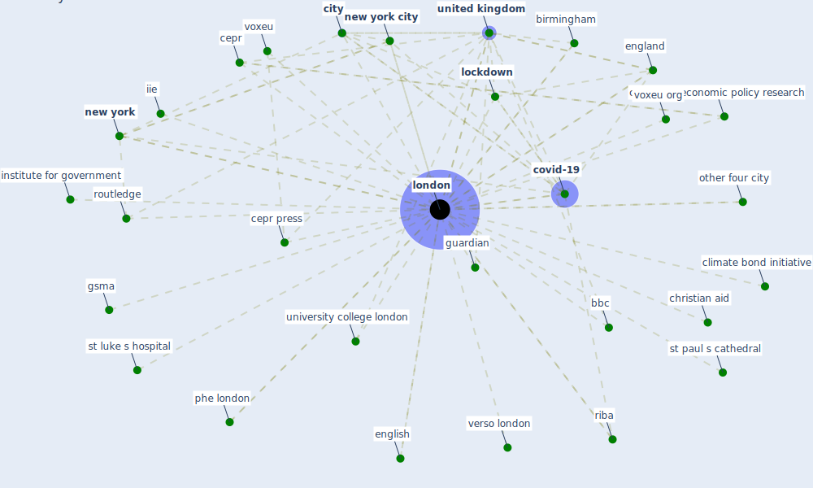

# Keyword: london

## Keywords

 * 2010 commonwealth game, bank of england, bbc, [berlin](keyword_berlin), birmingham, blackwell bmj book, british, british architect, building service engineer, cape town, carbon descent, cbi, ccc london, centre for economic policy research, cepr, cepr press, charity commission, christian aid, churchill livingstone, ciria, [city](keyword_city), city hall, climate bond, climate bond initiative, [covid 19 pandemic](keyword_covid_19_pandemic), [covid-19](keyword_covid-19), department of health, elen macarthur foundation, england, english, [europe](keyword_europe), gsma, guardian, hm stationary office, [hong kong](keyword_hong_kong), house of commons library, iie, iie london, institute for government, lago, [lockdown](keyword_lockdown), lockdown condition, lockdown measure, [london](keyword_london), london borough of camden, london love business, london metropolitan university, madrid, megacitie, nesta, [new south wale](keyword_new_south_wale), [new york](keyword_new_york), [new york city](keyword_new_york_city), newham, news news, newsham, nicolson, oneworld, other city, other four city, overcrowd, palgrave macmillan, paris, phe, phe london, prentice hall, public health england, riba, riba enterprise, rlb, [rome](keyword_rome), [route](keyword_route), routledge, routledgetaylor francis, sage publication, school of economic, [seoul](keyword_seoul), soho, st andrew s cathedral, st luke s hospital, st paul s cathedral, st paul s hospital, taylor francis, the british academy, [toronto](keyword_toronto), transportation system, ucl, ukdh london, [united kingdom](keyword_united_kingdom), university college london, university of oxford, verso, verso london, victorian metropolis, voxeu, voxeu org, walbrook, willey and son, woodshop, workplace unlimited

## Mapping

## Neighbours

### Closest articles

* Study of COVID-19 pandemic in London (UK) from urban context - [LINK](article_ghosh_study_2020)
* Urban planning after COVID-19 - [LINK](article_rtpi_urban_2021)
* World Bank Development Report - [LINK](article_world_bank_world_2022)
* Health, Wellbeing \& Productivity in Offices - [LINK](article_world_green_building_council_health_2014)
* How COVID-19 Could Accelerate the Adoption of New Retail Technologies and Enhance the (E-)Servicescape - [LINK](article_willems_how_2021)
* Strategies to Mitigate COVID-19 Pandemic Impacts on Health and Safety of Workers in Construction Projects - [LINK](article_kaushal_strategies_2021)
* Attitudes towards outdoor and neighbour noise during the COVID-19 lockdown: A case study in London - [LINK](article_lee_attitudes_2021)
* Strengthening resilience: a priority shared by Health 2020 and - [LINK](article_who_strengthening_2017)
* The Impact of COVID-19 on Public Space: A Review of the Emerging Questions - [LINK](article_honey-roses_impact_2020)
* The City Under COVID‐19: Podcasting As Digital Methodology - [LINK](article_rogers_city_2020)

### Closest BPs

