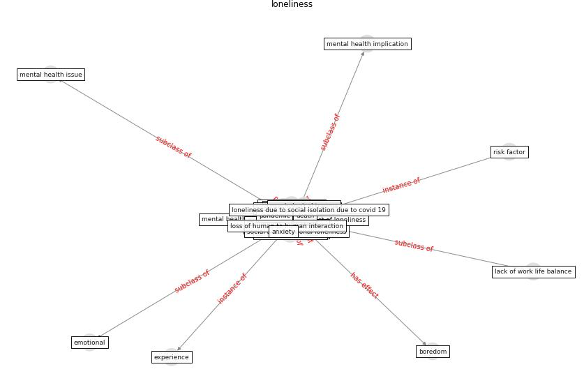

# Keyword: loneliness

* [health-mental](cluster_Cluster_15)

## Keywords

 * Cluster_15, affect, alienation, [anxiety](keyword_anxiety), boredom, community impact of loneliness, cope strategy, [covid 19 pandemic](keyword_covid_19_pandemic), [covid-19](keyword_covid-19), death, [depression](keyword_depression), disabled loneliness, disabling loneliness, effect on loneliness, emotional, experi ence, experience, feeling of, frustration, impact of loneliness, isolation, lack of work life balance, letterwrite, [loneliness](keyword_loneliness), loneliness paradox, loneliness scale, loss of human to human interaction, multidimensional, multidimensionality, news article on impact of loneliness, news article on impact of loneliness and way of address they, old people, [pandemic](keyword_pandemic), post traumatic fixmestress disorder, [psychological](keyword_psychological), quarantine, risk factor, [social](keyword_social), socialisolation, [stress](keyword_stress), ucla loneliness scale, weiss s typology, weiss typology

## Concepts

 

## Neighbours

### Closest articles

* How loneliness is talked about in social media during COVID-19 pandemic: Text mining of 4,492 Twitter feeds - [LINK](article_koh_how_2022)
* How our homes impact our health: using a COVID-19 informed approach to examine urban apartment housing - [LINK](article_peters_how_2020)
* The psychological impact of COVID-19 on the mental health in the general population - [LINK](article_serafini_psychological_2020)
* Guidelines for Responding to COVID-19 Pandemic: Best Practices, Impacts, and Future Research Directions - [LINK](article_assaad_guidelines_2021)
* Towards Resilient Residential Buildings and Neighborhoods in Light of COVID-19 Pandemic—The Scenario of Podgorica, Montenegro - [LINK](article_bojovic_towards_2022)
* Psychological Effects of Home Confinement and Social Distancing Derived from COVID-19 in the General Population—A Systematic Review - [LINK](article_rodriguez-fernandez_psychological_2021)
* The Impact of COVID-19 on Public Space: A Review of the Emerging Questions - [LINK](article_honey-roses_impact_2020)
* Coronavirus questions that will not go away: interrogating urban and socio-spatial implications of COVID-19 measures - [LINK](article_salama_coronavirus_2020)
* 10 tech trends getting us through the COVID-19 pandemic - [LINK](article_yan_10_2020)

### Closest BPs

