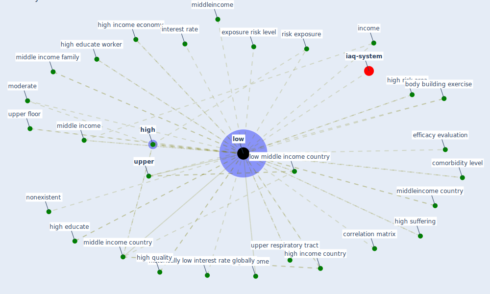

# Keyword: low

* [iaq-system](cluster_3)

## Keywords

 * Cluster_3, [bacs](keyword_bacs), body building exercise, cold temperature, comorbidity, comorbidity level, concentration level, correlation matrix, efficacy evaluation, epidemic circulation, exposure risk level, extremely cold temperature, growth, [high](keyword_high), high educate, high educate worker, high income, high income country, high income economy, high protein, high quality, high risk area, high suffering, high temperature, historically low interest rate globally, hot rameter, income, interest rate, [low](keyword_low), low activity level, low middle income country, lower, lowermiddle income, lowermiddle income country, lowest, mazria, middle income, middle income area, middle income country, middle income family, middleincome, middleincome country, middleincome economy, moderate, nonexistent, paint, respiratory tract, [risk](keyword_risk), risk exposure, [se](keyword_se), severity, [upper](keyword_upper), upper floor, upper respiratory tract

## Mapping

## Neighbours

### Closest articles

* World Bank Development Report - [LINK](article_world_bank_world_2022)
* Urban planning after COVID-19 - [LINK](article_rtpi_urban_2021)
* Prophylactic Architecture: Formulating the Concept of Pandemic-Resilient Homes - [LINK](article_elrayies_prophylactic_2022)
* Health, Economic and Social Development Challenges of the COVID-19 Pandemic: Strategies for Multiple and Interconnected Issues - [LINK](article_panneer_health_2022)
* Addressing vulnerability, building resilience: community-based adaptation to vector-borne diseases in the context of global change - [LINK](article_bardosh_addressing_2017)
* Effects of temperature and humidity on the spread of COVID-19: A systematic review - [LINK](article_mecenas_effects_2020)
* COVID-19 risks and systemic gaps in Nigeria: resilience building lessons for pandemic and climate change management - [LINK](article_lawal_covid-19_2022)
* What has been the impact of the COVID-19 pandemic on immigrants? An update on recent evidence - [LINK](article_oecd_what_2022)
* Exploring the Potential of Artificial Intelligence and Machine Learning to Combat COVID-19 and Existing Opportunities for LMIC: A Scoping Review - [LINK](article_naseem_exploring_2020)
* How COVID-19 Could Accelerate the Adoption of New Retail Technologies and Enhance the (E-)Servicescape - [LINK](article_willems_how_2021)

### Closest BPs

