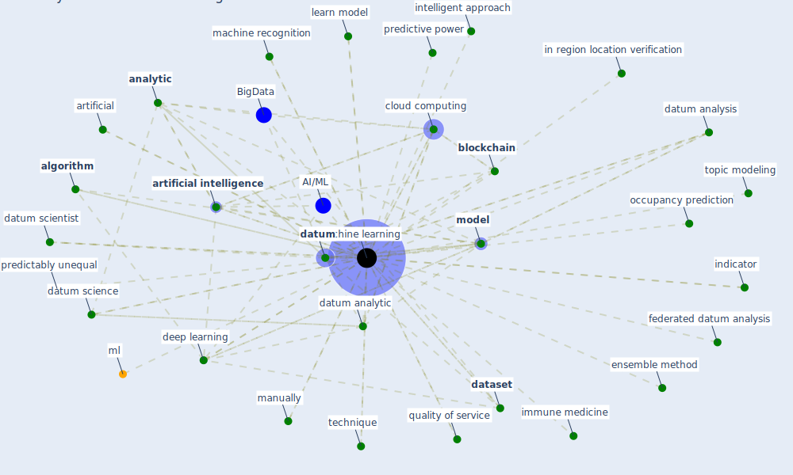

# Keyword: machine learning

* [wastewater-water](cluster_0)

## Keywords

 * 3d deep learning framework, AI/ML, Cluster_0, accurately predict the spread, accurately predict the spread of the virus, ai system, [algorithm](keyword_algorithm), algorithmic bias, [analysis](keyword_analysis), analysis method, [analytic](keyword_analytic), artificial, [artificial intelligence](keyword_artificial_intelligence), automatically detect, [big datum](keyword_big_datum), [blockchain](keyword_blockchain), classify, cloud computing, computer application, cornell university, [correlate](keyword_correlate), credit risk modeling, [dataset](keyword_dataset), [datum](keyword_datum), datum analysis, datum analytic, datum mining, datum science, datum scientist, [deep learning](keyword_deep_learning), [detect](keyword_detect), detection limit, [diagnosis](keyword_diagnosis), docking, [efficacy](keyword_efficacy), ensemble method, federated datum analysis, fight covid 19, gene editing, genomically, genomically comprehensive, [healthcare](keyword_healthcare), how ai, immune medicine, in region location verification, [indicator](keyword_indicator), intelligent approach, [learn](keyword_learn), learn model, location verification, logit, [machine learning](keyword_machine_learning), machine recognition, manually, mathematical, ml, ml ml, mobile microscopy, [model](keyword_model), model and predict, model base analysis, occupancy prediction, occupancy prediction model, [ontology](keyword_ontology), particle detection, [phenopacket](keyword_phenopacket), predictably unequal, predictive power, quality of service, quantification, random forest, rapidly test the efficacy, reverse vaccinology, risk assessment, robotically resolvable, srinivasan, statistical, technique, [technology](keyword_technology), test the efficacy, textmine, topic modeling, train, un supervise, underwrite, unsupervised, x yao, 마스크 검출, 애플리케이션 주기에 따라 자동으로 시작하고 및 중 출

## Mapping

## Neighbours

### Closest articles

* A Comprehensive Review of the COVID-19 Pandemic and the Role of IoT, Drones, AI, Blockchain, and 5G in Managing its Impact - [LINK](article_chamola_comprehensive_2020)
* World Bank Development Report - [LINK](article_world_bank_world_2022)
* Contributions of Smart City Solutions and Technologies to Resilience against the COVID-19 Pandemic: A Literature Review - [LINK](article_sharifi_contributions_2021)
* How COVID-19 Could Accelerate the Adoption of New Retail Technologies and Enhance the (E-)Servicescape - [LINK](article_willems_how_2021)
* How loneliness is talked about in social media during COVID-19 pandemic: Text mining of 4,492 Twitter feeds - [LINK](article_koh_how_2022)
* A comprehensive review on indoor air quality monitoring systems for enhanced public health - [LINK](article_saini_comprehensive_2020)
* Challenges of data sharing in European Covid-19 projects: A learning opportunity for advancing pandemic preparedness and response - [LINK](article_tacconelli_challenges_2022)
* DeepSOCIAL: Social Distancing Monitoring and Infection Risk Assessment in COVID-19 Pandemic - [LINK](article_rezaei_deepsocial_2020)
* The effect of occupant distribution on energy consumption and COVID-19 infection in buildings: A case study of university building - [LINK](article_mokhtari_effect_2021)
* Attitudes towards outdoor and neighbour noise during the COVID-19 lockdown: A case study in London - [LINK](article_lee_attitudes_2021)

### Closest BPs

