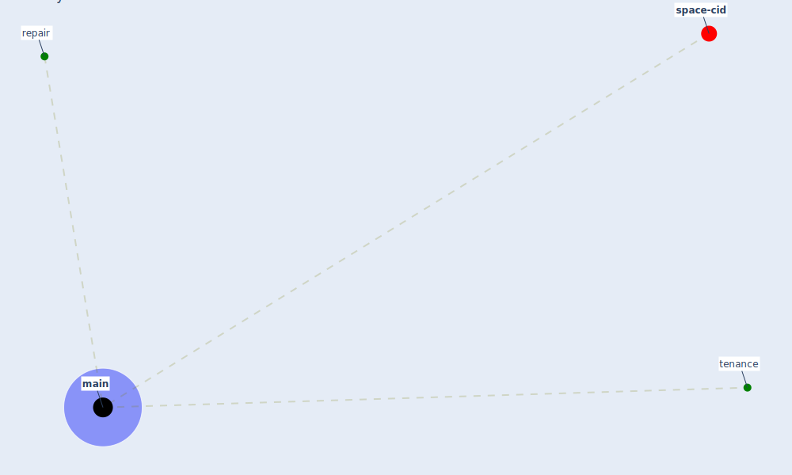

# Keyword: main

* [space-cid](cluster_2)

## Keywords

 * Cluster_2, [main](keyword_main), repair, tenance

## Mapping

## Neighbours

### Closest articles

* A review of facilities management interventions to mitigate respiratory infections in existing buildings - [LINK](article_zhang_review_2022)

### Closest BPs

