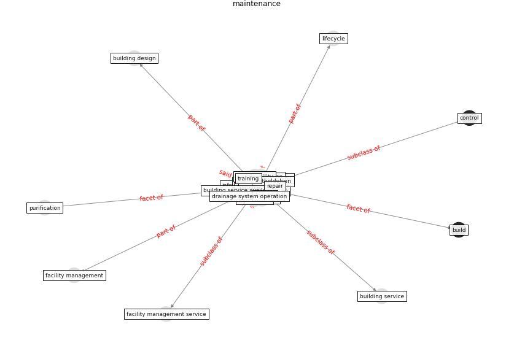

# Keyword: maintenance

* [building-guidance](cluster_Cluster_15)

## Keywords

 * Cluster_15, air quality, battery, [build](keyword_build), building design, building operation, building service, building service availability, bulb, bulb replacement, calibration, [clean](keyword_clean), commission, [construction](keyword_construction), [control](keyword_control), control strategy, cost, [design](keyword_design), drainage system operation, [energy efficiency](keyword_energy_efficiency), energy usage, engineer, [facility management](keyword_facility_management), facility management service, fastholdelsen, fault fault prediction, fault prediction, hygienic, [infrastructure](keyword_infrastructure), inspection, installation, lifecycle, [maintenance](keyword_maintenance), management, [monitor](keyword_monitor), [ontology](keyword_ontology), operate, [operation](keyword_operation), [plan](keyword_plan), purification, repair, replace, safety and security, sanitation, [sustainability](keyword_sustainability), technical, [testing](keyword_testing), [training](keyword_training), training protocol, upkeep, water quality

## Concepts

 

## Neighbours

### Closest articles

* Overcoming the Impact of COVID-19 Using Integrated Project Delivery Model - [LINK](article_g_overcoming_2020)
* A review of facilities management interventions to mitigate respiratory infections in existing buildings - [LINK](article_zhang_review_2022)
* A Global Survey of Infection Control and Mitigation Measures for Combating the Transmission of COVID-19 Pandemic in Buildings Under Facilities Management Services - [LINK](article_sarvari_global_2022)
* Indoor Air Quality: Rethinking rules of building design strategies in post-pandemic architecture - [LINK](article_megahed_indoor_2021)
* Assessment of Building Automation and Control Systems in Danish Healthcare Facilities in the COVID-19 Era - [LINK](article_pedersen_assessment_2022)
* The role of green roofs in post COVID-19 confinement: An analysis of willingness to pay - [LINK](article_manso_role_2021)
* Emerging from Lockdown: CIBSE COVID-19 Guidance - [LINK](article_cibse_emerging_2020)
* Strategies to Mitigate COVID-19 Pandemic Impacts on Health and Safety of Workers in Construction Projects - [LINK](article_kaushal_strategies_2021)
* The effect of a redesigned floor plan, occupant density and the quality of indoor climate on the cost of space, productivity and sick leave in an office building–A case study - [LINK](article_saari_effect_2006)
* Assessment method for new sustainability indicators providing pandemic resilience for residential buildings - [LINK](article_tokazhanov_assessment_2021)

### Closest BPs

