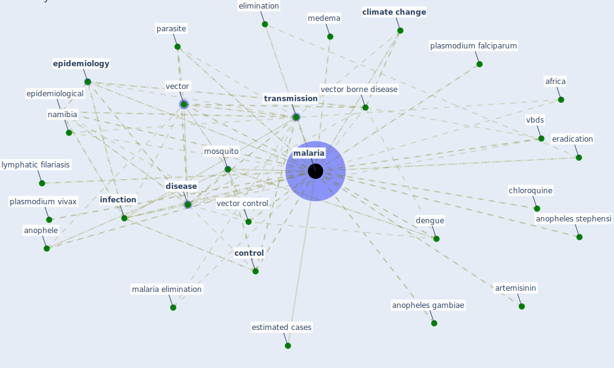

# Keyword: malaria

* [malaria-vector](cluster_13)

## Keywords

 * a phone catchment area, accepted benefits, [africa](keyword_africa), anophele, anopheles gambiae, anopheles stephensi, artemisinin, caminade c, [chinese](keyword_chinese), chloroquine, [climate change](keyword_climate_change), climatechange, cn, [control](keyword_control), control and elimination, ddt, death rate, defining the architecture of community participation, [dengue](keyword_dengue), diphtheria, [disease](keyword_disease), [elimination](keyword_elimination), endemicity, [epidemiological](keyword_epidemiological), epidemiologist, [epidemiology](keyword_epidemiology), eradication, estimated cases, fact sheet about malaria, filariasis, high malaria transmission in africa, [hiv](keyword_hiv), hydroxychloroquine, idomal, immunity, importation, [infection](keyword_infection), infection exportation, [infectious disease](keyword_infectious_disease), interrupted transmission, intervention, intervention efforts, locally acquired malaria, lumefantrine, lymphatic filariasis, [malaria](keyword_malaria), malaria climate sensitivity, malaria control, malaria control in china, malaria elimination, malaria eradication, malaria map, malaria parasite, malaria planning, malaria prevention, malaria risk mapping, malaria transmission, malnourished, medema, [mitigation](keyword_mitigation), mitigation of the risk of malaria, [mortality](keyword_mortality), [mosquito](keyword_mosquito), mosquito vector, move comm, [namibia](keyword_namibia), neglected diseases, panama canal, [pandemic](keyword_pandemic), parasite, [pathogen](keyword_pathogen), peri urban transmission, plasmodium falciparum, plasmodium falciparum malaria, plasmodium vivax, poverty, propagate the spread, [public health](keyword_public_health), research institute for climate and society, [rift valley fever](keyword_rift_valley_fever), [risk](keyword_risk), riskfactors, socio economic development, source factor, source factors, south sudan, sporadic autochthonous transmission, [spread](keyword_spread), [tanzania](keyword_tanzania), [transmission](keyword_transmission), [usa](keyword_usa), [vbd](keyword_vbd), vbds, [vector](keyword_vector), [vector borne disease](keyword_vector_borne_disease), vector control, vectorborne diseases, vectorcontrol, who, wu k

## Mapping

## Neighbours

### Closest articles

* Decision Making within the Built Environment as a Strategy for Mitigating the Risk of Malaria and Other Vector-Borne Diseases - [LINK](article_obonyo_decision_2018)
* Addressing vulnerability, building resilience: community-based adaptation to vector-borne diseases in the context of global change - [LINK](article_bardosh_addressing_2017)
* Integrating rapid risk mapping and mobile phone call record data for strategic malaria elimination planning - [LINK](article_tatem_integrating_2014)
* Challenges to Mitigating the Urban Health Burden of Mosquito-Borne Diseases in the Face of Climate Change - [LINK](article_ligsay_challenges_2021)
* Prototype Early Warning Systems for Vector-Borne Diseases in Europe - [LINK](article_semenza_prototype_2015)
* The impact of climate change on the epidemiology and control of Rift Valley fever - PubMed - [LINK](article_martin_impact_2008)
* COVID-19 and the UN Sustainable Development Goals: Threat to Solidarity or an Opportunity? - [LINK](article_leal_filho_covid-19_2020)
* COVID-19 risks and systemic gaps in Nigeria: resilience building lessons for pandemic and climate change management - [LINK](article_lawal_covid-19_2022)
* An Overview of Biomedical Ontologies for Pandemics and Infectious Diseases Representation - [LINK](article_bayoudhi_overview_2021)
* Nurture to nature via COVID-19, a self-regenerating environmental strategy of environment in global context - [LINK](article_paital_nurture_2020)

### Closest BPs

