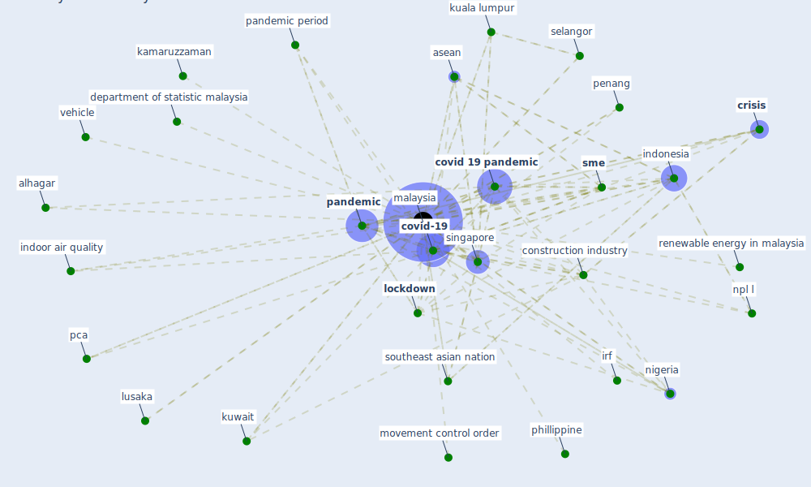

# Keyword: malaysia

## Keywords

 * air quality, alhagar, amia, aquaculture, [asean](keyword_asean), azmal, bank negara malaysia, [bim](keyword_bim), bim benefits, car use be globally on the rise, case study, [construction industry](keyword_construction_industry), [coronavirus](keyword_coronavirus), corporate debt restructure committee, [covid 19 pandemic](keyword_covid_19_pandemic), covid 19 pandemic lockdown, [covid-19](keyword_covid-19), [crisis](keyword_crisis), debt restructure committee, department of statistic malaysia, free malaysia, free malaysia today, gdp, impulse response, impulse response function, [indonesia](keyword_indonesia), [indoor air quality](keyword_indoor_air_quality), irf, [italy](keyword_italy), its neighbour, kamaruzaman, kamaruzzaman, klang valley, kuala lumpur, [kuwait](keyword_kuwait), [lockdown](keyword_lockdown), lockdown to curb the outbreak of covid 19, lusaka, [malaysia](keyword_malaysia), malaysian construction industry, movement control order, [nigeria](keyword_nigeria), norhafizalina, npl l, [pandemic](keyword_pandemic), pandemic period, pca, penang, penang inst, phillippine, renewable energy in malaysia, saad m s h, selangor, singapore, [sme](keyword_sme), smoe, southeast asian nation, [spain](keyword_spain), the pandemic, the singapore government, trust in medium, uk108, urbanisation, vehicle

## Mapping

## Neighbours

### Closest articles

* COVID-19 and regional solutions for mitigating the risk of SME finance in selected ASEAN member states - [LINK](article_taghizadeh-hesary_covid-19_2022)
* Urban planning after COVID-19 - [LINK](article_rtpi_urban_2021)
* World Bank Development Report - [LINK](article_world_bank_world_2022)
* How COVID-19 Could Accelerate the Adoption of New Retail Technologies and Enhance the (E-)Servicescape - [LINK](article_willems_how_2021)
* Mechanisms for addressing the impact of COVID-19 on infrastructure projects - [LINK](article_king_mechanisms_2021)
* Designing for COVID-2x: Reflecting on Future-Proofing Human Habitation for the Inevitable Next Pandemic - [LINK](article_spennemann_designing_2022)
* Analysis of COVID-19 Concerns Raised by the Construction Workforce and Development of Mitigation Practices - [LINK](article_bou_hatoum_analysis_2021)
* Decision Making within the Built Environment as a Strategy for Mitigating the Risk of Malaria and Other Vector-Borne Diseases - [LINK](article_obonyo_decision_2018)
* Occupant health in buildings: Impact of the COVID-19 pandemic on the opinions of building professionals and implications on research - [LINK](article_awada_occupant_2022)
* Scalable IoT Architecture for Monitoring IEQ Conditions in Public and Private Buildings - [LINK](article_calvo_scalable_2022)

### Closest BPs

