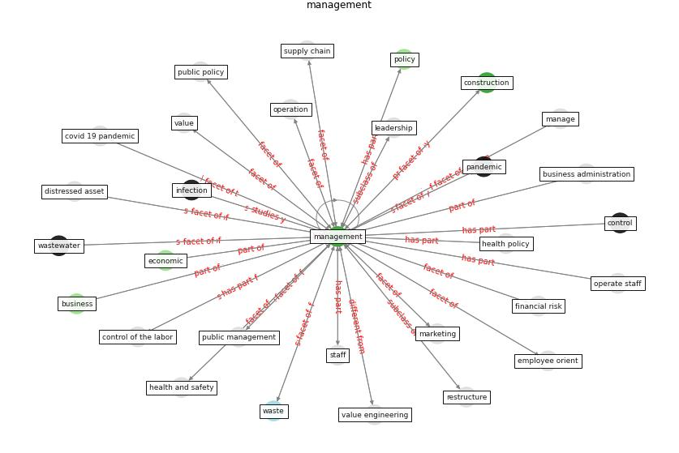

# Keyword: __management__
## Clusters

* Cluster 6: [construction-project](cluster_6)

## Concepts

 

## Top 10 articles for __management__
* How COVID-19 Could Accelerate the Adoption of
New Retail Technologies and Enhance the
(E-)Servicescape ([willems_how_2021](article_willems_how_2021))
* world_bank_world_2022 ([world_bank_world_2022](article_world_bank_world_2022))
* Management of the COVID-19 pandemic: challenges,
practices, and organizational support ([hossny_management_2022](article_hossny_management_2022))
* A study on office workplace modification during the
COVID-19 pandemic in The Netherlands ([hou_study_2021](article_hou_study_2021))
* Mechanisms for addressing the impact of COVID-19 on
infrastructure projects ([king_mechanisms_2021](article_king_mechanisms_2021))
* Assessment of COVID-19 precautionary measures in sports
facilities: A case study on a health club in Saudi
Arabia ([ibrahim_assessment_2022](article_ibrahim_assessment_2022))
* When the fourth water and digital revolution encountered
COVID-19 ([poch_when_2020](article_poch_when_2020))
* Mapping research in logistics and supply chain management
during COVID-19 pandemic ([montoya-torres_mapping_2021](article_montoya-torres_mapping_2021))
* Effects of the COVID-19 pandemic on the use and
perceptions of urban green space: An international
exploratory study ([ugolini_effects_2020](article_ugolini_effects_2020))
* Contributions of Smart City Solutions and
Technologies to Resilience against the COVID-19
Pandemic: A Literature Review ([sharifi_contributions_2021](article_sharifi_contributions_2021))
