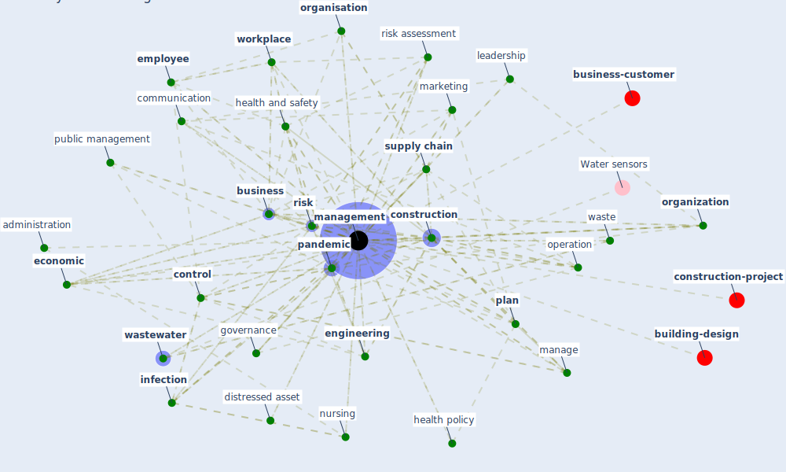

# Keyword: management

* [building-design](cluster_5)

* [construction-project](cluster_8)

* [business-customer](cluster_11)

## Keywords

 * action, [adaptation](keyword_adaptation), administration, administrative leadership, [business](keyword_business), business administration, business process, cloud computing, communication, competency, [construction](keyword_construction), construction engineering, [control](keyword_control), control of the labor, [covid 19 pandemic](keyword_covid_19_pandemic), crisis management, datum storage, department, [design](keyword_design), discipline, [disease](keyword_disease), disposal, distressed asset, [economic](keyword_economic), effective response system, [employee](keyword_employee), employee orient, energy policy, [engineering](keyword_engineering), [facility](keyword_facility), field research, food supply chain, fund, governance, [health and safety](keyword_health_and_safety), [health club](keyword_health_club), health policy, [healthcare](keyword_healthcare), hierarchy, [hospital](keyword_hospital), identification, [infection](keyword_infection), [infection control](keyword_infection_control), [infrastructure](keyword_infrastructure), knowledge science, leadership, leadership skill, [logistic](keyword_logistic), maintenance, manage, [management](keyword_management), [marketing](keyword_marketing), monopoly, npl, [nursing](keyword_nursing), nursing manager, operation, [organisation](keyword_organisation), [organization](keyword_organization), organizational, [pandemic](keyword_pandemic), [perceive risk](keyword_perceive_risk), [plan](keyword_plan), [policy](keyword_policy), [project management](keyword_project_management), project team, [public](keyword_public), public management, public policy, quality of management, [resilience](keyword_resilience), restructure, [risk](keyword_risk), risk assessment, risk management, [sanitation](keyword_sanitation), [sign](keyword_sign), site level factors, staff, stewardship, strategic retail management, [strategy](keyword_strategy), supervisory oversight, [supply chain](keyword_supply_chain), [supply chain management](keyword_supply_chain_management), theory, trainee, [treatment](keyword_treatment), triage, [urban planning](keyword_urban_planning), value, [value engineering](keyword_value_engineering), waste, [wastewater](keyword_wastewater), water system, [wildlife](keyword_wildlife), wildlife support, [workforce](keyword_workforce), [workplace](keyword_workplace), workplace re entry

## Mapping

## Neighbours

### Closest articles

* How COVID-19 Could Accelerate the Adoption of New Retail Technologies and Enhance the (E-)Servicescape - [LINK](article_willems_how_2021)
* World Bank Development Report - [LINK](article_world_bank_world_2022)
* Management of the COVID-19 pandemic: challenges, practices, and organizational support - [LINK](article_hossny_management_2022)
* A study on office workplace modification during the COVID-19 pandemic in The Netherlands - [LINK](article_hou_study_2021)
* Assessment of COVID-19 precautionary measures in sports facilities: A case study on a health club in Saudi Arabia - [LINK](article_ibrahim_assessment_2022)
* Mechanisms for addressing the impact of COVID-19 on infrastructure projects - [LINK](article_king_mechanisms_2021)
* Mapping research in logistics and supply chain management during COVID-19 pandemic - [LINK](article_montoya-torres_mapping_2021)
* When the fourth water and digital revolution encountered COVID-19 - [LINK](article_poch_when_2020)
* Green infrastructure through the lens of “One Health”: A systematic review and integrative framework uncovering synergies and trade-offs between mental health and wildlife support in cities - [LINK](article_felappi_green_2020)
* Impacts of COVID-19 on Health and Safety of Workforce in Construction Industry - [LINK](article_pamidimukkala_impacts_2021)

### Closest BPs

