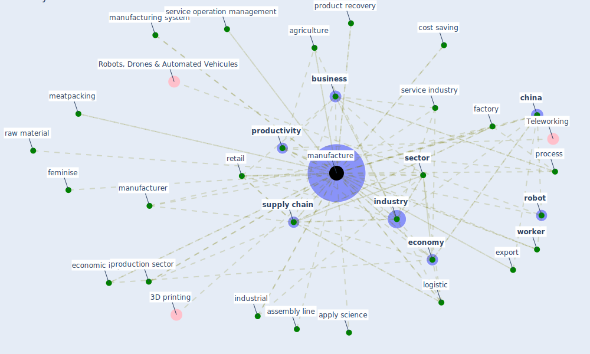

# Keyword: manufacture

## Keywords

 * 3D printing, [3d print](keyword_3d_print), adaptive manufacturing, agriculture, [algorithm](keyword_algorithm), apply science, artisanal, assembly line, automation, [business](keyword_business), business service and administration, [china](keyword_china), [circular economy](keyword_circular_economy), cloud computing, [company](keyword_company), continuous improvement, [coronavirus](keyword_coronavirus), [cost](keyword_cost), cost saving, covid world, [covid-19](keyword_covid-19), craft, destination of value add, economic impact, [economy](keyword_economy), [efficiency](keyword_efficiency), efficiency of the company, energy intensive, engineering design, export, [factory](keyword_factory), feminise, food, holonic, industrial, [industry](keyword_industry), industry 4 0, inventory, inventory management, [job](keyword_job), letter, [logistic](keyword_logistic), make to be fabricate, [manufacture](keyword_manufacture), manufactured, manufacturer, manufacturing, manufacturing space, manufacturing system, meatpacking, occupation, [organization](keyword_organization), out source, pandemic control, physic, [plan](keyword_plan), process, product, product recovery, production, production plant, production sector, [productivity](keyword_productivity), profession, rapid prototyping, raw material, remote operation, retail, [robot](keyword_robot), [sector](keyword_sector), service industry, service operation management, service sector, shortage of raw material, [simulation](keyword_simulation), [sme](keyword_sme), stationery, [supply chain](keyword_supply_chain), [travel](keyword_travel), uncertainty, value chain, [worker](keyword_worker)

## Mapping

## Neighbours

### Closest articles

* A critical analysis of the impacts of COVID-19 on the global economy and ecosystems and opportunities for circular economy strategies - [LINK](article_ibn-mohammed_critical_2021)
* The COVID-19 pandemic: Lessons on building more equal and sustainable societies - [LINK](article_van_barneveld_covid-19_2020)
* 10 tech trends getting us through the COVID-19 pandemic - [LINK](article_yan_10_2020)
* Mapping research in logistics and supply chain management during COVID-19 pandemic - [LINK](article_montoya-torres_mapping_2021)
* Impact of COVID-19 on IoT Adoption in Healthcare, Smart Homes, Smart Buildings, Smart Cities, Transportation and Industrial IoT - [LINK](article_umair_impact_2021)
* COVID-19 Prevention and Control Measures in Workplace Settings: A Rapid Review and Meta-Analysis - [LINK](article_ingram_covid-19_2021)
* Propositions for a Resilient, Post-COVID-19 Future for the AEC Industry - [LINK](article_nassereddine_propositions_2021)
* Digital Twin of COVID-19 Mass Vaccination Centers - [LINK](article_pilati_digital_2021)
* Global value chains: Efficiency and risks in the context of COVID-19 - [LINK](article_oecd_global_2021)
* Nurture to nature via COVID-19, a self-regenerating environmental strategy of environment in global context - [LINK](article_paital_nurture_2020)

### Closest BPs

