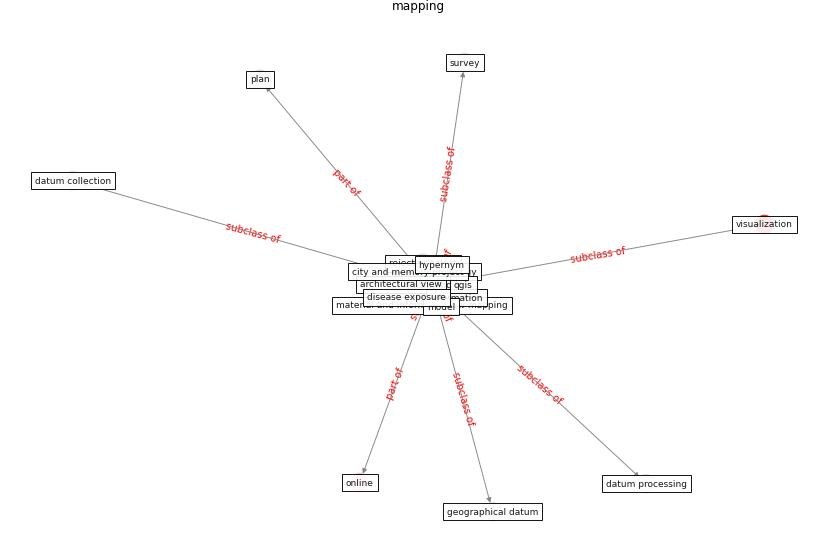

# Keyword: __mapping__
## Clusters

* Cluster 13: [resilience-sme](cluster_13)

## Concepts

 

## Articles
* martin_impact_2008 ([martin_impact_2008](article_martin_impact_2008))
* Overcoming the Impact of COVID-19 Using Integrated
Project Delivery Model ([g_overcoming_2020](article_g_overcoming_2020))
* COVID-19 Higher Mortality in Chinese Regions
With Chronic Exposure to Lower Air Quality ([pansini_covid-19_2021](article_pansini_covid-19_2021))
* An Overview of Ontologies and Tool Support for
COVID-19 Analytics ([ahmad_overview_2021](article_ahmad_overview_2021))
* south_china_morning_post_china_2020 ([south_china_morning_post_china_2020](article_south_china_morning_post_china_2020))
* Digital Twin of COVID-19 Mass Vaccination
Centers ([pilati_digital_2021](article_pilati_digital_2021))
* Mobile Technology Solution for COVID-19:
Surveillance and Prevention ([raza_mobile_2021](article_raza_mobile_2021))
* Seeing the invisible hand: Underlying effects of
COVID-19 on tourists’ behavioral patterns ([li_seeing_2020](article_li_seeing_2020))
* The City Under COVID‐19: Podcasting As
Digital Methodology ([rogers_city_2020](article_rogers_city_2020))
* Learning from the COVID-19 pandemic in governing smart
cities ([bolivar_learning_2022](article_bolivar_learning_2022))
