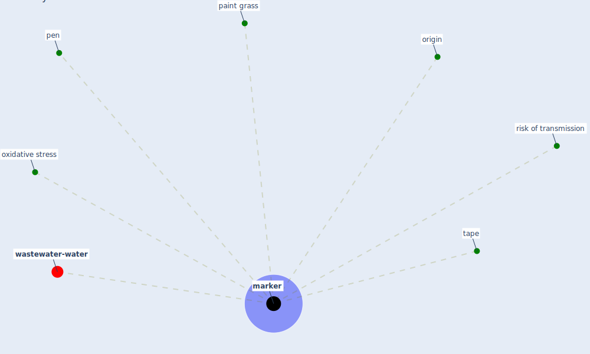

# Keyword: marker

* [wastewater-water](cluster_0)

## Keywords

 * Cluster_0, [marker](keyword_marker), markers, origin, oxidative stress, paint grass, pen, risk of transmission, tape

## Mapping

## Neighbours

### Closest articles

* COVID19-Routes: A Safe Pedestrian Navigation Service - [LINK](article_cantarero_covid19-routes_2021)
* Impact of Covid-19 on the built environment - [LINK](article_mahima_impact_2022)
* Retail Signage During the COVID-19 Pandemic - [LINK](article_mcneish_retail_2020)
* COVID-19 Could Leverage a Sustainable Built Environment - [LINK](article_pinheiro_covid-19_2020)
* Future perspectives of wastewater-based epidemiology: Monitoring infectious disease spread and resistance to the community level - [LINK](article_sims_future_2020)

### Closest BPs

