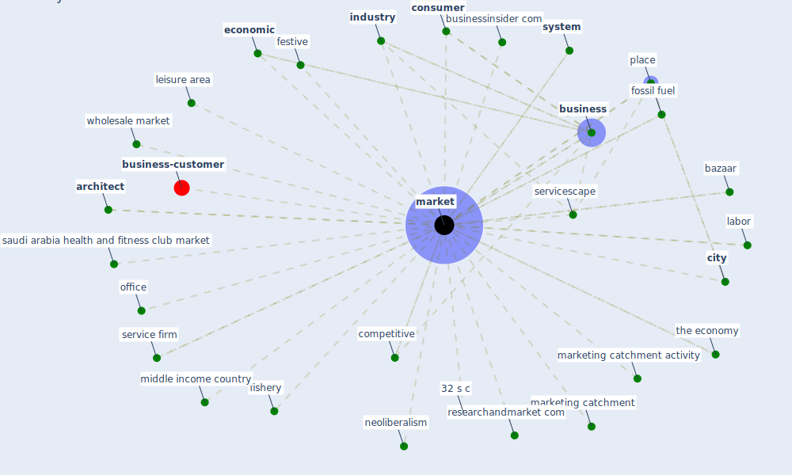

# Keyword: market

* [business-customer](cluster_11)

## Keywords

 * 32 s c, Cluster_11, alternative finance, annual_report, [architect](keyword_architect), bazaar, border, [business](keyword_business), businessinsider com, [city](keyword_city), cnbc, competitive, competitiveness, [construction](keyword_construction), construction market, [consumer](keyword_consumer), consumer credit, [country](keyword_country), credit rationing, debt, demand, design and build, discipline, due diligence, [economic](keyword_economic), economic opportunity, [economy](keyword_economy), export, festive, fishery, [fossil fuel](keyword_fossil_fuel), gather, [germany](keyword_germany), grocery, huanan, [industry](keyword_industry), [information](keyword_information), issue, [italy](keyword_italy), labor, leisure area, [market](keyword_market), market research, market research report, market share, marketed, marketing catchment, marketing catchment activity, markets, middle income country, neoliberalism, office, place, pricing, [public](keyword_public), research report, researchandmarket com, revenue, saudi arabia health and fitness club market, self drive, sense, [service](keyword_service), service firm, servicescape, [social](keyword_social), stock exchange, [switzerland](keyword_switzerland), [system](keyword_system), system perspective, the economy, wholesale market, zillow

## Mapping

## Neighbours

### Closest articles

* World Bank Development Report - [LINK](article_world_bank_world_2022)
* How COVID-19 Could Accelerate the Adoption of New Retail Technologies and Enhance the (E-)Servicescape - [LINK](article_willems_how_2021)
* Impact of Covid-19 on the built environment - [LINK](article_mahima_impact_2022)
* Contextualizing the Covid-19 pandemic for a carbon-constrained world: Insights for sustainability transitions, energy justice, and research methodology - [LINK](article_sovacool_contextualizing_2020)
* Questioning the use of the balcony in apartments during the COVID-19 pandemic process - [LINK](article_aydin_questioning_2020)
* Urban planning after COVID-19 - [LINK](article_rtpi_urban_2021)
* Propositions for a Resilient, Post-COVID-19 Future for the AEC Industry - [LINK](article_nassereddine_propositions_2021)
* Navigating Climate Change: Rethinking the Role of Buildings - [LINK](article_cole_navigating_2020)
* Assessment of COVID-19 precautionary measures in sports facilities: A case study on a health club in Saudi Arabia - [LINK](article_ibrahim_assessment_2022)
* Mechanisms for addressing the impact of COVID-19 on infrastructure projects - [LINK](article_king_mechanisms_2021)

### Closest BPs

