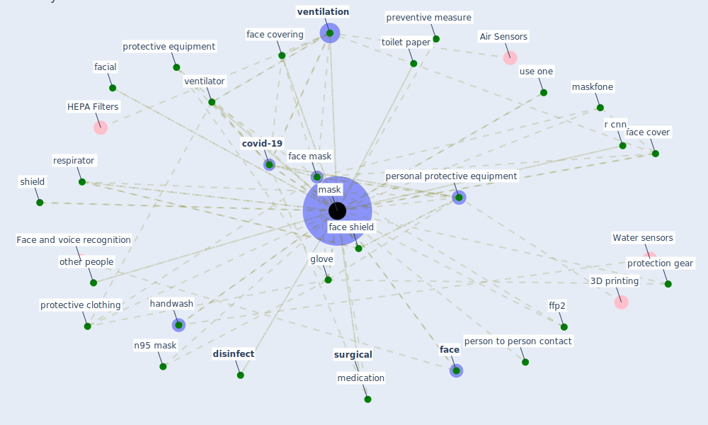

# Keyword: mask

## Keywords

 * [3d print](keyword_3d_print), air pollute, airborne transmission, alcohol hand spray, barrier, [cdc](keyword_cdc), cdc s, contact lense, [coronavirus](keyword_coronavirus), covering, covid 19 pandemic in mainland china, [covid-19](keyword_covid-19), cross ventilation, culture, [customer](keyword_customer), [deep learning](keyword_deep_learning), disease transmission, [disinfect](keyword_disinfect), exposure time, eye mask, fabric, [face](keyword_face), face cover, face covering, face mask, face mask detection, face shield, facial, ffp2, ffp3, [filter](keyword_filter), filter mask, functional, gather less, gauze, gel hydro alcoholic, glove, group session, handwash, [infection](keyword_infection), infection rate, [influenza](keyword_influenza), influenza virus transmission, [mask](keyword_mask), maskfone, medication, medicine, mouth cover, n95 mask, new rule, other people, p100 filter, person to person contact, [personal protective equipment](keyword_personal_protective_equipment), pharmacy, ppe doff, ppe like glove, [precautionary measure](keyword_precautionary_measure), preventive measure, protection, protection gear, protective clothing, protective equipment, protective suit, r cnn, respirator, respiratory mask, respiratory protection, reusable mask, safety criterion, [sample](keyword_sample), secret, shield, shopper, single sided ventilation, snood, speech transcribe, staff, standard steriliser, steriliser, [surgical](keyword_surgical), taxi driver, the secret behind the mask, the sense of wear it, toilet paper, use one, ven tilation, [ventilation](keyword_ventilation), [ventilator](keyword_ventilator), wash hand regularly, wear, wear a mask, wear mask, with psynetmasks, with tamadramasks, without mask, work time, workplace outbreak, world, figure

## Mapping

## Neighbours

### Closest articles

* The ventilation of buildings and other mitigating measures for COVID-19: a focus on wintertime - [LINK](article_burridge_ventilation_2021)
* Supporting Technologies for COVID-19 Prevention: Systemized Review - [LINK](article_zhao_supporting_2022)
* An Automated System to Limit COVID-19 Using Facial Mask Detection in Smart City Network - [LINK](article_rahman_automated_2020)
* COVID-19 misinformation: Accuracy of articles about coronavirus prevention mostly shared on social media - [LINK](article_obiala_covid-19_2021)
* How COVID-19 Could Accelerate the Adoption of New Retail Technologies and Enhance the (E-)Servicescape - [LINK](article_willems_how_2021)
* Physical interventions to interrupt or reduce the spread of respiratory viruses: systematic review - [LINK](article_jefferson_physical_2008)
* COVID-19 Prevention and Control Measures in Workplace Settings: A Rapid Review and Meta-Analysis - [LINK](article_ingram_covid-19_2021)
* COVID-19 Pandemic: Prevention and Protection Measures to Be Adopted at the Workplace - [LINK](article_cirrincione_covid-19_2020)
* A critical review of heating, ventilation, and air conditioning (HVAC) systems within the context of a global SARS-CoV-2 epidemic - [LINK](article_elsaid_critical_2021)
* Analysis of COVID-19 Concerns Raised by the Construction Workforce and Development of Mitigation Practices - [LINK](article_bou_hatoum_analysis_2021)

### Closest BPs

