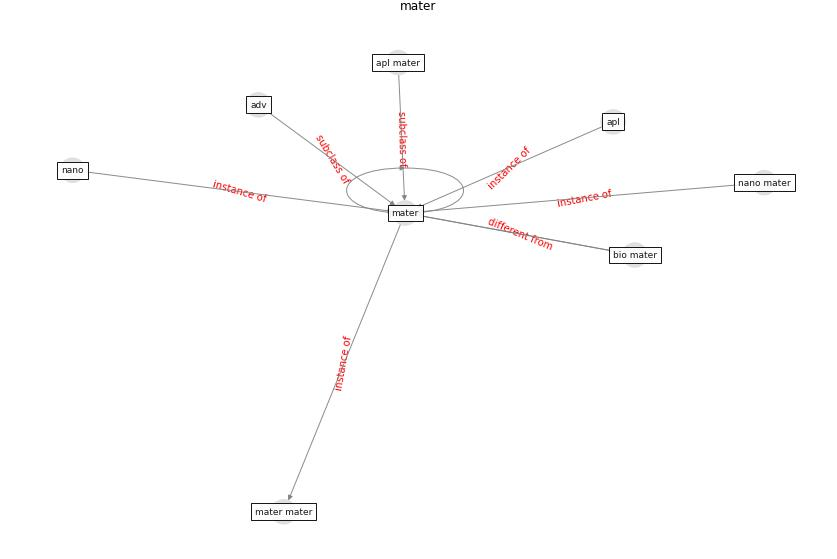

# Keyword: __mater__

## Concepts

 

## Top articles for __mater__
* A Review on Building Design as a Biomedical
System for Preventing COVID-19 Pandemic ([amran_review_2022](article_amran_review_2022))
* Graphene-based nanomaterials as antimicrobial surface
coatings: A parallel approach to restrain the expansion
of COVID-19 ([ayub_graphene-based_2021](article_ayub_graphene-based_2021))
* A Surface Coating that Rapidly Inactivates
SARS-CoV-2 ([behzadinasab_surface_2020](article_behzadinasab_surface_2020))
