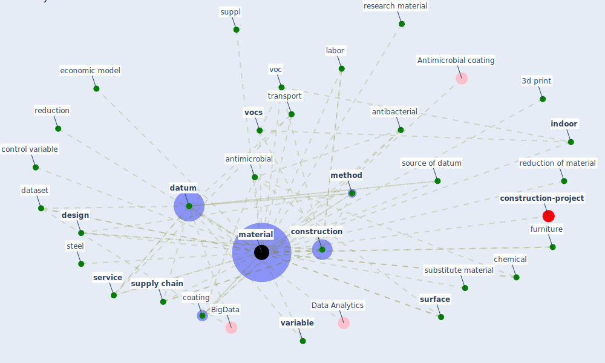

# Keyword: material

* [construction-project](cluster_8)

## Keywords

 * [3d print](keyword_3d_print), Cluster_8, anti microbial, antibacterial, [antimicrobial](keyword_antimicrobial), [build](keyword_build), chemical, [coating](keyword_coating), colour, [construction](keyword_construction), construction method, construction process, control variable, [dataset](keyword_dataset), [datum](keyword_datum), [design](keyword_design), economic model, furniture, [graphene](keyword_graphene), [indoor](keyword_indoor), [information](keyword_information), input, interior finish, labor, [material](keyword_material), material and method 2 1 1, materials, [method](keyword_method), morphological, [recycle](keyword_recycle), reduction, reduction of material, research material, [service](keyword_service), source of datum, steel, substitute material, suppl, [supply chain](keyword_supply_chain), [surface](keyword_surface), [transport](keyword_transport), [variable](keyword_variable), voc, [vocs](keyword_vocs), waste

## Mapping

## Neighbours

### Closest articles

* Revisiting the built environment: 10 potential development changes and paradigm shifts due to COVID-19 - [LINK](article_cheshmehzangi_revisiting_2021)
* How is COVID-19 Experience Transforming Sustainability Requirements of Residential Buildings? A Review - [LINK](article_tokazhanov_how_2020)
* A Review on Building Design as a Biomedical System for Preventing COVID-19 Pandemic - [LINK](article_amran_review_2022)
* Assessment method for new sustainability indicators providing pandemic resilience for residential buildings - [LINK](article_tokazhanov_assessment_2021)
* COVID-19 Could Leverage a Sustainable Built Environment - [LINK](article_pinheiro_covid-19_2020)
* A critical analysis of the impacts of COVID-19 on the global economy and ecosystems and opportunities for circular economy strategies - [LINK](article_ibn-mohammed_critical_2021)
* Readiness Assessment of Green Building Certification Systems for Residential Buildings during Pandemics - [LINK](article_tleuken_readiness_2021)
* Environmental factors involved in SARS-CoV-2 transmission: effect and role of indoor environmental quality in the strategy for COVID-19 infection control - [LINK](article_azuma_environmental_2020)
* Addressing vulnerability, building resilience: community-based adaptation to vector-borne diseases in the context of global change - [LINK](article_bardosh_addressing_2017)
* Graphene-based nanomaterials as antimicrobial surface coatings: A parallel approach to restrain the expansion of COVID-19 - [LINK](article_ayub_graphene-based_2021)

### Closest BPs

