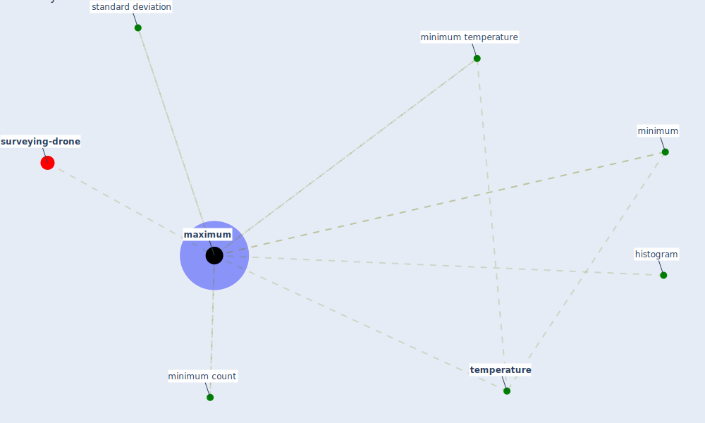

# Keyword: maximum

* [surveying-drone](cluster_13)

## Keywords

 * Cluster_13, histogram, [maximum](keyword_maximum), minimum, minimum count, minimum temperature, standard deviation, [temperature](keyword_temperature)

## Mapping

## Neighbours

### Closest articles

* Perception of COVID-19 impacts on the construction industry over time - [LINK](article_rokooei_perception_2022)
* Study of COVID-19 pandemic in London (UK) from urban context - [LINK](article_ghosh_study_2020)
* Architectural Design Drives the Biogeography of Indoor Bacterial Communities - [LINK](article_kembel_architectural_2014)
* EXPOSED: An occupant exposure model for confined spaces to retrofit crowd models during a pandemic - [LINK](article_ronchi_exposed_2020)
* The effect of occupant distribution on energy consumption and COVID-19 infection in buildings: A case study of university building - [LINK](article_mokhtari_effect_2021)
* Scalable IoT Architecture for Monitoring IEQ Conditions in Public and Private Buildings - [LINK](article_calvo_scalable_2022)
* Digital Twin of COVID-19 Mass Vaccination Centers - [LINK](article_pilati_digital_2021)

### Closest BPs

