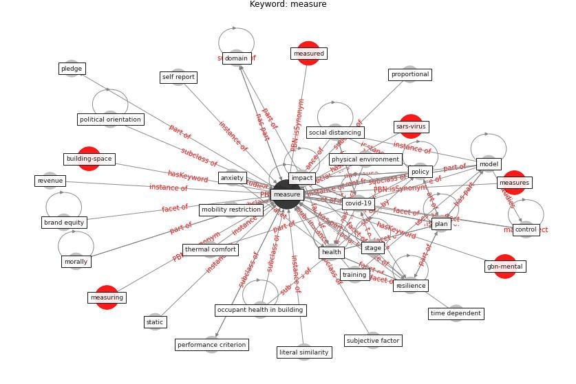

# Keyword: measure

* [building-space](cluster_Cluster_0)

* [sars-virus](cluster_Cluster_9)

* [gbn-mental](cluster_Cluster_12)

## Keywords

 * Cluster_12, Cluster_9, absolute difference similarity, [anxiety](keyword_anxiety), brand equity, building performance, capacity limitation, category, chemically stabilize, [climate change](keyword_climate_change), combine measure, compliance with stay at home measure, confound, [control](keyword_control), control covid 19, covid 19 control, [covid-19](keyword_covid-19), crisis management, cross sectional design, [datum](keyword_datum), [density](keyword_density), deterrent, deterrent effect, [domain](keyword_domain), empirical, empirical evidence, energy saving, environmental control, environmental control measure, [flourish](keyword_flourish), frequency, [health](keyword_health), [housing](keyword_housing), [impact](keyword_impact), impact on individual, ineffective, [infection control](keyword_infection_control), [infection prevention and control](keyword_infection_prevention_and_control), intrusiveness, job retention scheme, literal similarity, manage risk, map, [measure](keyword_measure), measured, measures, measuring, metric, mitigate the virus spread, mobility restriction, [model](keyword_model), [monitor](keyword_monitor), morally, non health care set social distancing measure, occupant health in building, online questionnaire, overcrowd in housing, [pandemic](keyword_pandemic), perceive, performance, performance criterion, physical environment, [plan](keyword_plan), pledge, [policy](keyword_policy), political orientation, practical capacity, process, proportional, proportionate, [public health](keyword_public_health), public s health, [qualitative](keyword_qualitative), quantitative, [quarantine](keyword_quarantine), [resilience](keyword_resilience), revenue, risk adjust, risk adjust performance, self isolation, self report, [social distancing](keyword_social_distancing), software application, specifically, stabilize, stage, static, subjective factor, suspension of judicial procedure, sustain, system resilience indicator, test, [thermal comfort](keyword_thermal_comfort), time dependent, time dependent measure, total number of patient vaccinate in a day npat, training, [vulnerability](keyword_vulnerability), wastewater treatment, water saving

## Concepts

 

## Neighbours

### Closest articles

* The Intelligent Lockdown: Compliance with COVID-19 Mitigation Measures in the Netherlands - [LINK](article_kuiper_intelligent_2020)
* How COVID-19 Could Accelerate the Adoption of New Retail Technologies and Enhance the (E-)Servicescape - [LINK](article_willems_how_2021)
* Compliance with COVID-19 Mitigation Measures in the United States - [LINK](article_van_rooij_compliance_2020)
* A review of definitions and measures of system resilience - [LINK](article_hosseini_review_2016)
* Health, Wellbeing \& Productivity in Offices - [LINK](article_world_green_building_council_health_2014)
* Sustainable work throughout the life course: National policies and strategies, Publications Office of the European Union - [LINK](article_eurofund_sustainable_2016)
* 2020 Data Protection Report - [LINK](article_council_of_europe_2020_2020)
* COVID19-Routes: A Safe Pedestrian Navigation Service - [LINK](article_cantarero_covid19-routes_2021)
* COVID-19 Prevention and Control Measures in Workplace Settings: A Rapid Review and Meta-Analysis - [LINK](article_ingram_covid-19_2021)
* When the fourth water and digital revolution encountered COVID-19 - [LINK](article_poch_when_2020)

### Closest BPs

