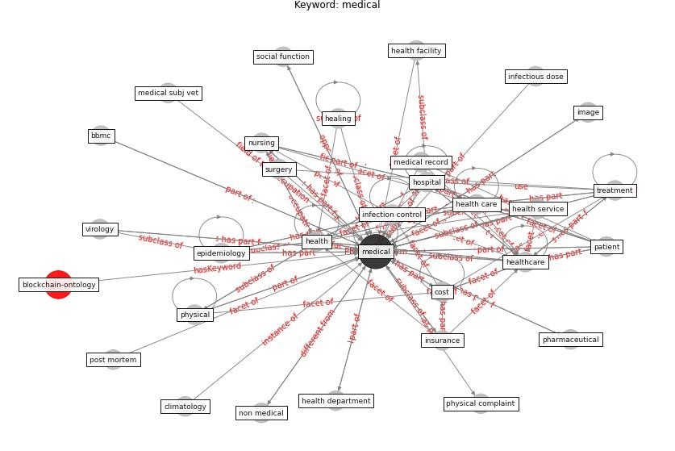

# Keyword: medical

* [health-patient](cluster_Cluster_14)

## Keywords

 * Cluster_14, ai research, [architecture](keyword_architecture), bbmc, bedside, bench, care, [china](keyword_china), climatology, cost, [covid 19 pandemic](keyword_covid_19_pandemic), [datum](keyword_datum), declaration of compete interest, [deep learning](keyword_deep_learning), diagnose, diagnosis, drone delivery, emergency department, emergency medicine, [engineering](keyword_engineering), [epidemiology](keyword_epidemiology), [gene](keyword_gene), hand hygiene, healing, [health](keyword_health), health and welfare professional, [health care](keyword_health_care), health department, health facility, health professional, health record, health science, health science and technology, health service, health specialist, [health system](keyword_health_system), [healthcare](keyword_healthcare), [hospital](keyword_hospital), image, immediate cure, [infection control](keyword_infection_control), infectious dose, insurance, [internet of thing](keyword_internet_of_thing), [iot](keyword_iot), iot device, life science, [medical](keyword_medical), medicine, microbiology, non medical, nuclear medical, [nurse](keyword_nurse), [nursing](keyword_nursing), ophthalmology, [patient](keyword_patient), pharmaceutical, pharmacy, [physical](keyword_physical), physician, post mortem, posthospital, psychiatric, [public health](keyword_public_health), radiology, [research](keyword_research), [robotic](keyword_robotic), sciences, scientist, screen, [staff](keyword_staff), [surgery](keyword_surgery), [technology](keyword_technology), treatment, vaccination, [vaccine](keyword_vaccine), virology, waste management, xpress

## Concepts

 

## Neighbours

### Closest articles

* Management of the COVID-19 pandemic: challenges, practices, and organizational support - [LINK](article_hossny_management_2022)
* A Mixed Approach on Resilience of Spanish Dwellings and Households during COVID-19 Lockdown - [LINK](article_cuerdo-vilches_mixed_2020)
* Health, Wellbeing \& Productivity in Offices - [LINK](article_world_green_building_council_health_2014)
* Urban Community Sustainable Development Patterns under the Influence of COVID-19: A Case Study Based on the Non-Contact Interaction Perspective of Hangzhou City - [LINK](article_wang_urban_2021)
* Mobile Technology Solution for COVID-19: Surveillance and Prevention - [LINK](article_raza_mobile_2021)
* A Comprehensive Review of the COVID-19 Pandemic and the Role of IoT, Drones, AI, Blockchain, and 5G in Managing its Impact - [LINK](article_chamola_comprehensive_2020)
* Significant applications of virtual reality for COVID-19 pandemic - [LINK](article_singh_significant_2020)
* Biophilic design in architecture and its contributions to health, well-being, and sustainability: A critical review - [LINK](article_zhong_biophilic_2022)
* DeepSOCIAL: Social Distancing Monitoring and Infection Risk Assessment in COVID-19 Pandemic - [LINK](article_rezaei_deepsocial_2020)
* Readiness Assessment of Green Building Certification Systems for Residential Buildings during Pandemics - [LINK](article_tleuken_readiness_2021)

### Closest BPs

