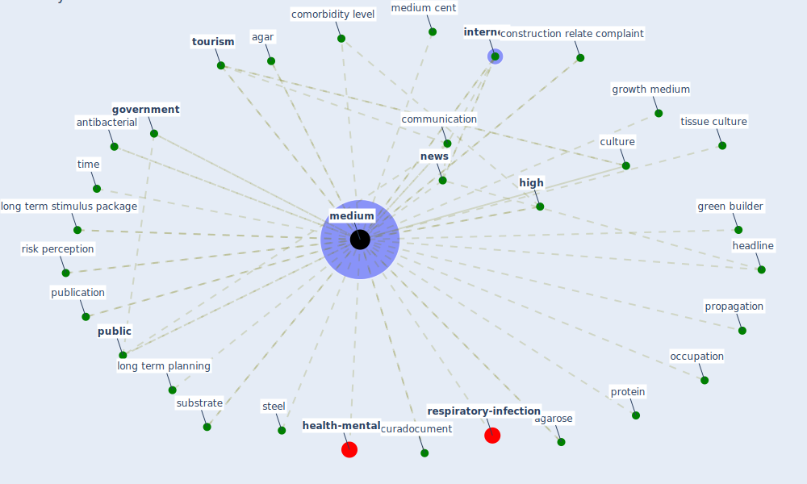

# Keyword: medium

* [health-mental](cluster_3)

* [respiratory-infection](cluster_10)

## Keywords

 * 6b3a4ae698bc42139572c76c5854ba76, Cluster_10, Cluster_3, agar, agar plate, agarose, analyze, antibacterial, aqueous, aqueous phase, [assay](keyword_assay), [business](keyword_business), cancerwarrior, cell culture, cfe, communication, comorbidity, comorbidity level, construction relate complaint, conversation, [crisis](keyword_crisis), culture, curadocument, d10, d10 medium, degree of occupant activity, enterprise, european society of cardiology, false news, [gardening](keyword_gardening), [government](keyword_government), governmental, green builder, growth medium, headline, [high](keyword_high), high medium, huawei, incubate, infection medium, [information](keyword_information), information seek, [internet](keyword_internet), level of occupation, long term, long term planning, long term stimulus package, luria bertani, mark ridley, media, mediate, [medium](keyword_medium), medium cent, medium group, medium report, narelleford, [news](keyword_news), next city, occupation, planetizen, propagation, protein, [public](keyword_public), publication, [research](keyword_research), risk exposure, [risk perception](keyword_risk_perception), saliva, [sample](keyword_sample), short, signmedia, small, [society](keyword_society), soft, steel, stimulus package, substrate, [surface](keyword_surface), technew, [technology](keyword_technology), time, tissue culture, [tourism](keyword_tourism), [virus](keyword_virus)

## Mapping

## Neighbours

### Closest articles

* Efficacy of an Automated Multiple Emitter Whole-Room Ultraviolet-C Disinfection System Against Coronaviruses MHV and MERS-CoV - [LINK](article_bedell_efficacy_2016)
* Revisiting the built environment: 10 potential development changes and paradigm shifts due to COVID-19 - [LINK](article_cheshmehzangi_revisiting_2021)
* A Comprehensive Review of the COVID-19 Pandemic and the Role of IoT, Drones, AI, Blockchain, and 5G in Managing its Impact - [LINK](article_chamola_comprehensive_2020)
* The changes in the effects of social media use of Cypriots due to COVID-19 pandemic - [LINK](article_kaya_changes_2020)
* Sustainability of Coronavirus on Different Surfaces - [LINK](article_suman_sustainability_2020)
* Upper-room ultraviolet air disinfection might help to reduce COVID-19 transmission in buildings: a feasibility study - [LINK](article_beggs_upper-room_2020)
* Seeing the invisible hand: Underlying effects of COVID-19 on tourists’ behavioral patterns - [LINK](article_li_seeing_2020)
* Environmental factors involved in SARS-CoV-2 transmission: effect and role of indoor environmental quality in the strategy for COVID-19 infection control - [LINK](article_azuma_environmental_2020)
* Analysis of COVID-19 Concerns Raised by the Construction Workforce and Development of Mitigation Practices - [LINK](article_bou_hatoum_analysis_2021)
* The impacts of knowledge, risk perception, emotion and information on citizens’ protective behaviors during the outbreak of COVID-19: a cross-sectional study in China - [LINK](article_ning_impacts_2020)

### Closest BPs

