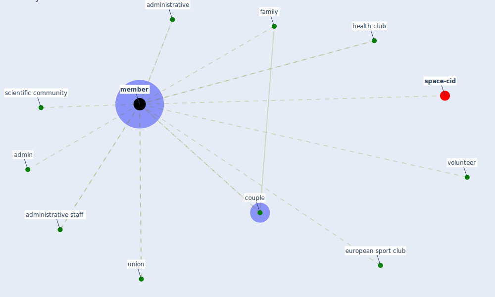

# Keyword: member

* [space-cid](cluster_2)

## Keywords

 * Cluster_2, admin, administrative, administrative staff, couple, european sport club, family, [health club](keyword_health_club), [member](keyword_member), members, scientific community, union, volunteer

## Mapping

## Neighbours

### Closest articles

* Assessment of COVID-19 precautionary measures in sports facilities: A case study on a health club in Saudi Arabia - [LINK](article_ibrahim_assessment_2022)
* Guidelines for Responding to COVID-19 Pandemic: Best Practices, Impacts, and Future Research Directions - [LINK](article_assaad_guidelines_2021)
* Refleksioner fra en pandemi - [LINK](article_realdania_refleksioner_2022)
* DeepSOCIAL: Social Distancing Monitoring and Infection Risk Assessment in COVID-19 Pandemic - [LINK](article_rezaei_deepsocial_2020)
* Infodemic and the spread of fake news in the COVID-19-era - [LINK](article_orso_infodemic_2020)
* How COVID-19 Could Accelerate the Adoption of New Retail Technologies and Enhance the (E-)Servicescape - [LINK](article_willems_how_2021)

### Closest BPs

