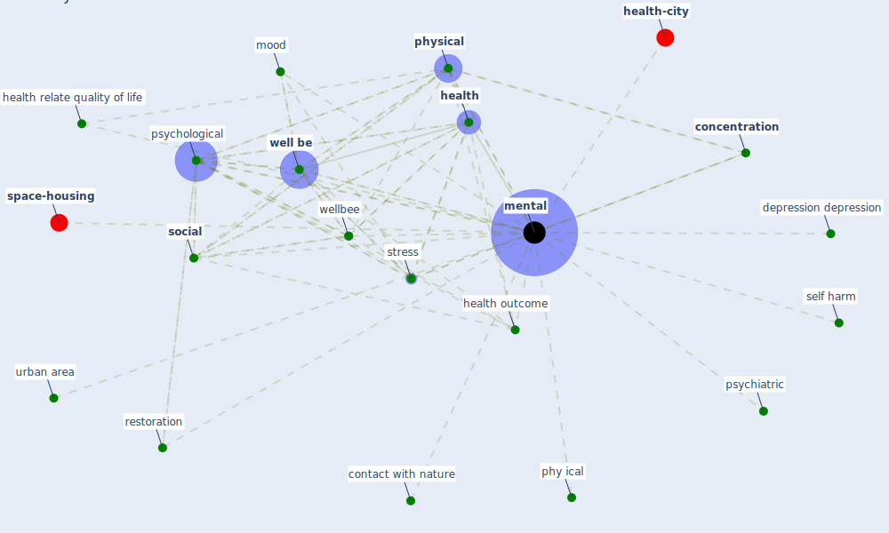

# Keyword: mental

* [health-mental](cluster_10)

## Keywords

 * Cluster_10, concentration, contact with nature, depression depression, [health](keyword_health), health outcome, health relate quality of life, [mental](keyword_mental), mood, phy ical, [physical](keyword_physical), psychiatric, [psychological](keyword_psychological), restoration, self harm, [social](keyword_social), [stress](keyword_stress), urban area, [well be](keyword_well_be), [wellbee](keyword_wellbee)

## Mapping

## Neighbours

### Closest articles

* Occupant health in buildings: Impact of the COVID-19 pandemic on the opinions of building professionals and implications on research - [LINK](article_awada_occupant_2022)
* Ten questions concerning occupant health in buildings during normal operations and extreme events including the COVID-19 pandemic - [LINK](article_awada_ten_2021)
* Towards Resilient Residential Buildings and Neighborhoods in Light of COVID-19 Pandemic—The Scenario of Podgorica, Montenegro - [LINK](article_bojovic_towards_2022)
* Prophylactic Architecture: Formulating the Concept of Pandemic-Resilient Homes - [LINK](article_elrayies_prophylactic_2022)
* The impact of the COVID-19 pandemic on the importance of urban green spaces to the public - [LINK](article_noszczyk_impact_2022)
* Designing Post COVID-19 Buildings: Approaches for Achieving Healthy Buildings - [LINK](article_navaratnam_designing_2022)
* COVID-19 Lockdown: Housing Built Environment’s Effects on Mental Health - [LINK](article_amerio_covid-19_2020)
* Green spaces, especially forest, linked to lower SARS-CoV-2 infection rates: A one-year nationwide study - [LINK](article_jiang_green_2021)
* Mental health and COVID-19 - [LINK](article_who_mental_2021)
* A Mixed Approach on Resilience of Spanish Dwellings and Households during COVID-19 Lockdown - [LINK](article_cuerdo-vilches_mixed_2020)

### Closest BPs

