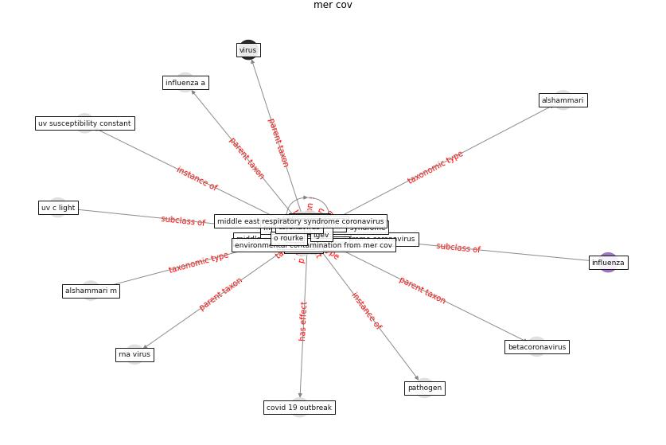

# Keyword: __mer cov__

## Concepts

 

## Top articles for __mer cov__
* Efficacy of an Automated Multiple Emitter
Whole-Room Ultraviolet-C Disinfection System
Against Coronaviruses MHV and MERS-CoV ([bedell_efficacy_2016](article_bedell_efficacy_2016))
* Upper-room ultraviolet air disinfection might help to
reduce COVID-19 transmission in buildings: a feasibility
study ([beggs_upper-room_2020](article_beggs_upper-room_2020))
