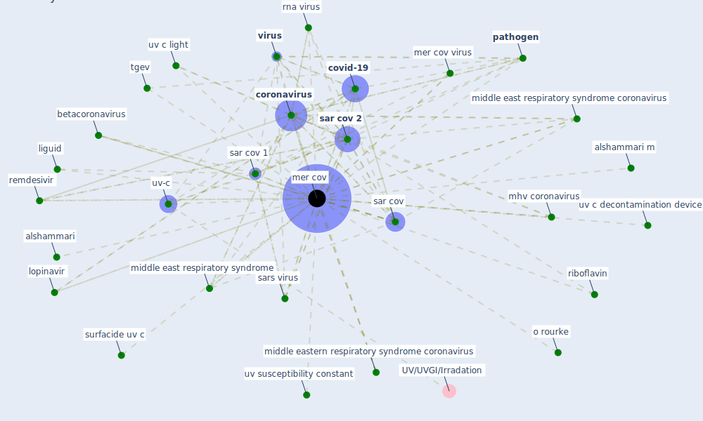

# Keyword: mer cov

## Keywords

 * alshammari, alshammari m, betacoronavirus, [coronavirus](keyword_coronavirus), covid 19 outbreak, [covid-19](keyword_covid-19), covs, hepatitis virus, influenza, influenza a, liguid, lopinavir, [mer cov](keyword_mer_cov), mer cov virus, mers cov, mhv coronavirus, middle east respiratory syndrome, middle east respiratory syndrome coronavirus, middle eastern respiratory syndrome coronavirus, o rourke, [pathogen](keyword_pathogen), remdesivir, riboflavin, rna virus, sar cov, [sar cov 1](keyword_sar_cov_1), [sar cov 2](keyword_sar_cov_2), sars virus, surfacide uv c, tgev, uv c decontamination device, uv c light, uv susceptibility constant, [uv-c](keyword_uv-c), [virus](keyword_virus), β cov

## Mapping

## Neighbours

### Closest articles

* Upper-room ultraviolet air disinfection might help to reduce COVID-19 transmission in buildings: a feasibility study - [LINK](article_beggs_upper-room_2020)
* Efficacy of an Automated Multiple Emitter Whole-Room Ultraviolet-C Disinfection System Against Coronaviruses MHV and MERS-CoV - [LINK](article_bedell_efficacy_2016)
* COVID-19 Pandemic: Prevention and Protection Measures to Be Adopted at the Workplace - [LINK](article_cirrincione_covid-19_2020)
* 2019 Novel Coronavirus (COVID-19) Pandemic: Built Environment Considerations To Reduce Transmission - [LINK](article_dietz_2019_2020)
* A Global Survey of Infection Control and Mitigation Measures for Combating the Transmission of COVID-19 Pandemic in Buildings Under Facilities Management Services - [LINK](article_sarvari_global_2022)
* Persistence of coronaviruses on inanimate surfaces and their inactivation with biocidal agents - [LINK](article_kampf_persistence_2020)
* RESIDENTIAL ARCHITECTURE IN A POST-PANDEMIC WORLD: IMPLICATIONS OF COVID-19 FOR NEW CONSTRUCTION AND FOR ADAPTING HERITAGE BUILDINGS - [LINK](article_spennemann_residential_2021)
* Nurture to nature via COVID-19, a self-regenerating environmental strategy of environment in global context - [LINK](article_paital_nurture_2020)
* Wastewater-Based Epidemiology to monitor COVID-19 outbreak: Present and future diagnostic methods to be in your radar - [LINK](article_barcelo_wastewater-based_2020)
* Ten questions concerning occupant health in buildings during normal operations and extreme events including the COVID-19 pandemic - [LINK](article_awada_ten_2021)

### Closest BPs

