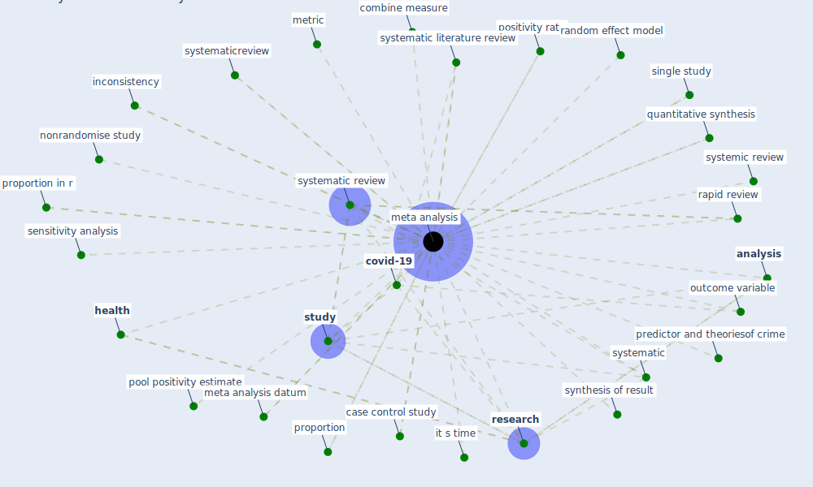

# Keyword: meta analysis

## Keywords

 * affect, [analysis](keyword_analysis), barendregt, case control study, combine measure, control study, [covid-19](keyword_covid-19), data availability statement, [datum](keyword_datum), double check, economic valuation of green and bluenature in city, economic valuation of green and bluetncnature in city, effect of loneliness on depression, effective therapy, estimate, evidence for prospect refuge theory, finding, fix effect, flip classroom, flip classroom improve stu dent learning, flip classroom improve stu dent learning in health profession education, [health](keyword_health), health and wellbeing, homogeneity, impact of new rapid transit, inconsistency, influence on loneliness, influence on loneliness in old adult, it s time, literature, meta analyses, [meta analysis](keyword_meta_analysis), meta analysis datum, methodology, metric, [mortality](keyword_mortality), nonrandomise study, outcome variable, pool positivity, pool positivity estimate, positive psychology intervention, positivity rate, predictor, predictor and theoriesof crime, proportion, proportion estimate, proportion in r, [public health](keyword_public_health), q12, quality assessment, quantitative synthesis, random effect, random effect model, randomize control study, rapid review, replicable, [research](keyword_research), risk appraisal, risk belief, sensitivity analysis, single study, stratify by intervention type, [study](keyword_study), synthesis of result, synthesize evidence, systematic, systematic literature review, systematic review, systematicreview, systemic review, the evidence for improving housing to reduce malaria

## Mapping

## Neighbours

### Closest articles

* COVID-19 Prevention and Control Measures in Workplace Settings: A Rapid Review and Meta-Analysis - [LINK](article_ingram_covid-19_2021)
* The ventilation of buildings and other mitigating measures for COVID-19: a focus on wintertime - [LINK](article_burridge_ventilation_2021)
* Supporting Technologies for COVID-19 Prevention: Systemized Review - [LINK](article_zhao_supporting_2022)
* Treating two pandemics for the price of one: Chronic and infectious disease impacts of the built and natural environment - [LINK](article_frank_treating_2021)
* How loneliness is talked about in social media during COVID-19 pandemic: Text mining of 4,492 Twitter feeds - [LINK](article_koh_how_2022)
* Physical interventions to interrupt or reduce the spread of respiratory viruses: systematic review - [LINK](article_jefferson_physical_2008)
* Health, Wellbeing \& Productivity in Offices - [LINK](article_world_green_building_council_health_2014)
* Respiratory pandemics, urban planning and design: A multidisciplinary rapid review of the literature - [LINK](article_harris_respiratory_2022)
* COVID-19 misinformation: Accuracy of articles about coronavirus prevention mostly shared on social media - [LINK](article_obiala_covid-19_2021)
* Effects of temperature and humidity on the spread of COVID-19: A systematic review - [LINK](article_mecenas_effects_2020)

### Closest BPs

