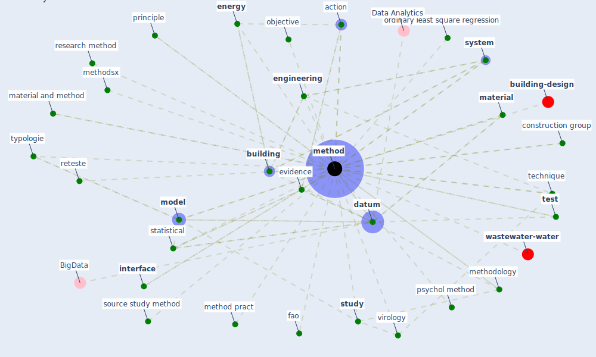

# Keyword: method

* [wastewater-water](cluster_0)

* [building-design](cluster_5)

## Keywords

 * 3c method, Cluster_0, Cluster_5, action, air purification, analyse, appl model, appl model method, [application](keyword_application), approach, automatic fever detection, bio mimic, box statistic test, [building](keyword_building), classification, combination, [concentration](keyword_concentration), concentration method, conclusion coding, conjugate gradient, [construction](keyword_construction), construction group, contact trace, cultivation, cultivation and assay of test virus, [datum](keyword_datum), datum analytic, descriptive research, [design](keyword_design), different construction group, [energy](keyword_energy), [engineering](keyword_engineering), engineering technique, [evidence](keyword_evidence), fao, field method, heuristic, iaq monitoring, [infection prevention and control](keyword_infection_prevention_and_control), input output database, [interface](keyword_interface), introduction, [knowledge](keyword_knowledge), laboratory, [material](keyword_material), material and method, material and method 2 1 2 1, mathematical, mechanism, [method](keyword_method), method method, method pract, methodology, methods, methodsx, [model](keyword_model), objective, ology, [openkg covid19](keyword_openkg_covid19), ordinary least square regression, principle, [protocol](keyword_protocol), psychol method, qual, quantitative, quantitative method, quantitative research, [research](keyword_research), research method, research methodology, reteste, rule, rule base, set, sewage surveillance, source, source study method, statistical, [strategy](keyword_strategy), [study](keyword_study), [system](keyword_system), technique, [test](keyword_test), testing, top down, two method, typologie, [urban](keyword_urban), urban entreprenecommunity planning, virology, wastewater treatment

## Mapping

## Neighbours

### Closest articles

* A Global Survey of Infection Control and Mitigation Measures for Combating the Transmission of COVID-19 Pandemic in Buildings Under Facilities Management Services - [LINK](article_sarvari_global_2022)
* First confirmed detection of SARS-CoV-2 in untreated wastewater in Australia: A proof of concept for the wastewater surveillance of COVID-19 in the community - [LINK](article_ahmed_first_2020)
* Influence between COVID-19 Impacts and Project Stakeholders in Chilean Construction Projects - [LINK](article_araya_influence_2021)
* Social distancing enhanced automated optimal design of physical spaces in the wake of the COVID-19 pandemic - [LINK](article_ugail_social_2021)
* Far-UVC light (222 nm) efficiently and safely inactivates airborne human coronaviruses - [LINK](article_buonanno_far-uvc_2020)
* SARS-CoV-2 RNA in wastewater anticipated COVID-19 occurrence in a low prevalence area - [LINK](article_randazzo_sars-cov-2_2020)
* Assessment method for new sustainability indicators providing pandemic resilience for residential buildings - [LINK](article_tokazhanov_assessment_2021)
* The socio-economic determinants of COVID-19: A spatial analysis of German county level data - [LINK](article_ehlert_socio-economic_2021)
* COVID-19 and the UN Sustainable Development Goals: Threat to Solidarity or an Opportunity? - [LINK](article_leal_filho_covid-19_2020)
* Strengthening resilience: a priority shared by Health 2020 and - [LINK](article_who_strengthening_2017)

### Closest BPs

