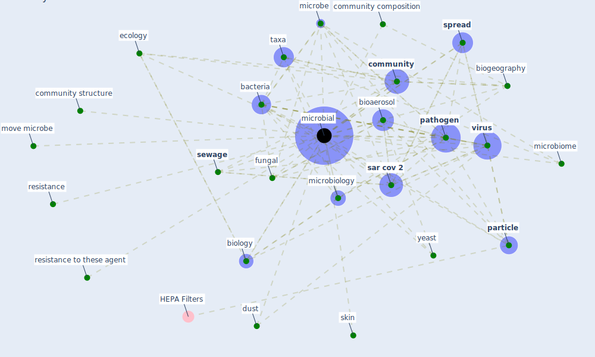

# Keyword: microbial

## Keywords

 * [bacteria](keyword_bacteria), [bioaerosol](keyword_bioaerosol), [biogeography](keyword_biogeography), biology, [community](keyword_community), community composition, community structure, dust, ecology, fungal, microbe, [microbial](keyword_microbial), microbiology, microbiome, move microbe, [particle](keyword_particle), [pathogen](keyword_pathogen), resistance, resistance to these agent, [sar cov 2](keyword_sar_cov_2), [sewage](keyword_sewage), skin, [spread](keyword_spread), [taxa](keyword_taxa), [virus](keyword_virus), yeast

## Mapping

## Neighbours

### Closest articles

* Architectural Design Drives the Biogeography of Indoor Bacterial Communities - [LINK](article_kembel_architectural_2014)
* 2019 Novel Coronavirus (COVID-19) Pandemic: Built Environment Considerations To Reduce Transmission - [LINK](article_dietz_2019_2020)
* The removal of airborne SARS-CoV-2 and other microbial bioaerosols by air filtration on COVID-19 surge units - [LINK](article_conway-morris_removal_2021)
* A Review on Building Design as a Biomedical System for Preventing COVID-19 Pandemic - [LINK](article_amran_review_2022)
* Far-UVC light (222 nm) efficiently and safely inactivates airborne human coronaviruses - [LINK](article_buonanno_far-uvc_2020)
* Prophylactic Architecture: Formulating the Concept of Pandemic-Resilient Homes - [LINK](article_elrayies_prophylactic_2022)
* Learning from pandemics: Applying resilience thinking to identify priorities for planning urban settlements - [LINK](article_syal_learning_2021)
* First confirmed detection of SARS-CoV-2 in untreated wastewater in Australia: A proof of concept for the wastewater surveillance of COVID-19 in the community - [LINK](article_ahmed_first_2020)
* Upper-room ultraviolet air disinfection might help to reduce COVID-19 transmission in buildings: a feasibility study - [LINK](article_beggs_upper-room_2020)
* Behind the Update: ASHRAE Handbook Chapters on UV-C to Include Updated Best Practices, Guidance - [LINK](article_ashrae_behind_2020)

### Closest BPs

