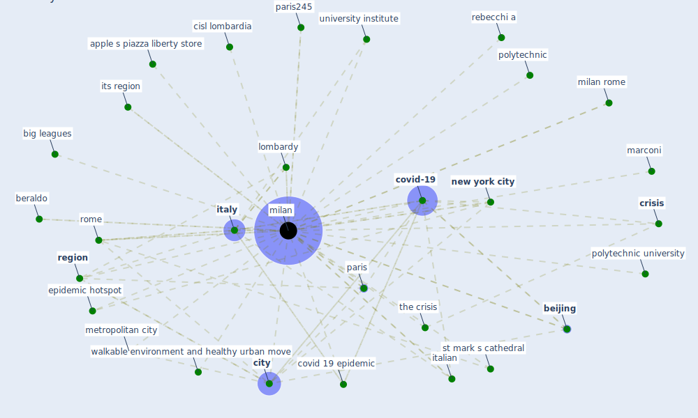

# Keyword: milan

## Keywords

 * apple s, apple s piazza liberty store, [beijing](keyword_beijing), beraldo, big leagues, cisl lombardia, [city](keyword_city), covid 19 epidemic, [covid 19 pandemic](keyword_covid_19_pandemic), [covid-19](keyword_covid-19), [crisis](keyword_crisis), efe, epic series, epic series in engineering, epidemic hotspot, italian, [italy](keyword_italy), its region, lombardy, marconi, metropolitan city, [milan](keyword_milan), milan rome, milan subj rome, milano, municipality, [new york city](keyword_new_york_city), paris, paris245, pastoor, pedestrian friendly, polytechnic, polytechnic university, rebecchi, rebecchi a, [region](keyword_region), [rome](keyword_rome), st mark s cathedral, the crisis, university institute, walkable environment and healthy urban move

## Mapping

## Neighbours

### Closest articles

* First detection of SARS-CoV-2 in untreated wastewaters in Italy - [LINK](article_la_rosa_first_2020)
* COVID-19 Lockdown: Housing Built Environment’s Effects on Mental Health - [LINK](article_amerio_covid-19_2020)
* Proximity and post-COVID-19 urban development: Reflections from Milan, Italy - [LINK](article_tricarico_proximity_2021)
* Respiratory pandemics, urban planning and design: A multidisciplinary rapid review of the literature - [LINK](article_harris_respiratory_2022)
* The COVID-19 pandemic: Impacts on cities and major lessons for urban planning, design, and management - [LINK](article_sharifi_covid-19_2020)
* Mobility Behaviour in View of the Impact of the COVID-19 Pandemic—Public Transport Users in Gdansk Case Study - [LINK](article_przybylowski_mobility_2021)
* The Role of Architecture and Urbanism in Preventing Pandemics - [LINK](article_kumar_role_2021)
*  - [LINK](article_dalessandro_covid-19_2020)
* Urban planning after COVID-19 - [LINK](article_rtpi_urban_2021)
* Urban Community Sustainable Development Patterns under the Influence of COVID-19: A Case Study Based on the Non-Contact Interaction Perspective of Hangzhou City - [LINK](article_wang_urban_2021)

### Closest BPs

