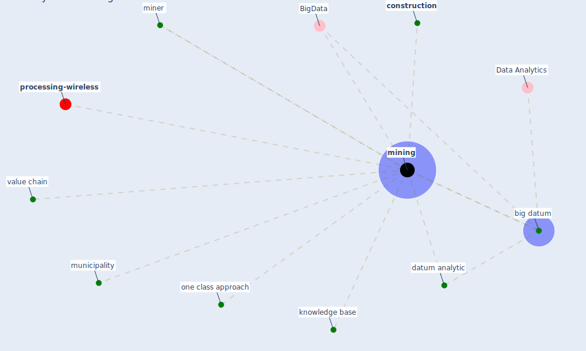

# Keyword: mining

* [processing-wireless](cluster_14)

## Keywords

 * BigData, Cluster_14, [big datum](keyword_big_datum), [construction](keyword_construction), datum analytic, knowledge base, miner, [mining](keyword_mining), municipality, one class approach, value chain

## Mapping

## Neighbours

### Closest articles

* Covid-19 and asset management in EU: a preliminary assessment of performance and investment styles - [LINK](article_rizvi_covid-19_2020)
* Blockchain technology and its applications to combat COVID-19 pandemic - [LINK](article_sharma_blockchain_2022)
* An Overview of Ontologies and Tool Support for COVID-19 Analytics - [LINK](article_ahmad_overview_2021)
* Continuous IEQ monitoring system: Context and development - [LINK](article_parkinson_continuous_2019)
* The COVID-19 pandemic: Impacts on cities and major lessons for urban planning, design, and management - [LINK](article_sharifi_covid-19_2020)
* Construction of a Linked Data Set of COVID-19 Knowledge Graphs: Development and Applications - [LINK](article_wang_construction_2022)
* DeepSOCIAL: Social Distancing Monitoring and Infection Risk Assessment in COVID-19 Pandemic - [LINK](article_rezaei_deepsocial_2020)
* Urban planning after COVID-19 - [LINK](article_rtpi_urban_2021)

### Closest BPs

