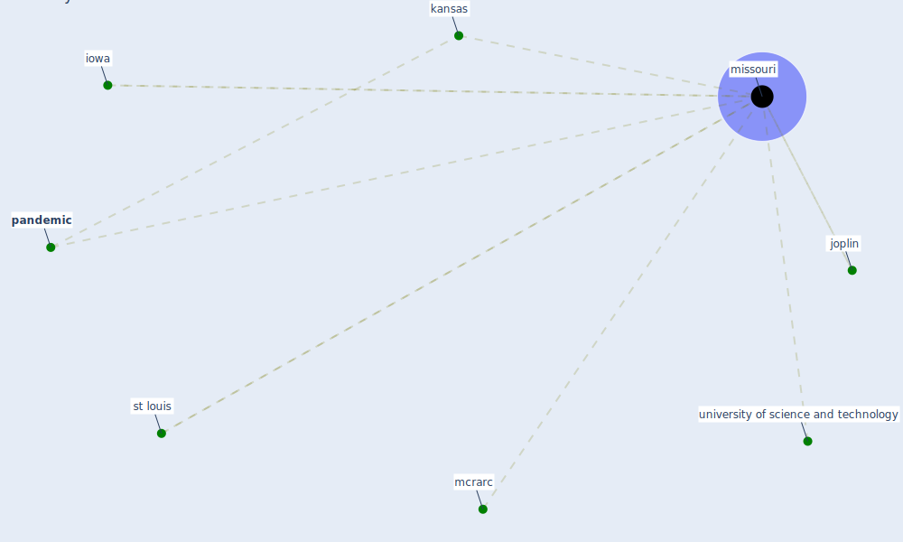

# Keyword: missouri

## Keywords

 * iowa, joplin, kansas, mcrarc, [missouri](keyword_missouri), [pandemic](keyword_pandemic), st louis, university of science and technology

## Mapping

## Neighbours

### Closest articles

* Multilevel Analysis of Personal, Non-Medical COVID-19-Related Impact Worldwide - [LINK](article_dye_multilevel_2020)
* World Bank Development Report - [LINK](article_world_bank_world_2022)
* Startups in times of crisis – A rapid response to the COVID-19 pandemic - [LINK](article_kuckertz_startups_2020)
* COVID-19 and the rise of intimate partner violence - [LINK](article_aguero_covid-19_2021)
* Guidelines for Responding to COVID-19 Pandemic: Best Practices, Impacts, and Future Research Directions - [LINK](article_assaad_guidelines_2021)
* COVID19-Routes: A Safe Pedestrian Navigation Service - [LINK](article_cantarero_covid19-routes_2021)
* A Comprehensive Review of the COVID-19 Pandemic and the Role of IoT, Drones, AI, Blockchain, and 5G in Managing its Impact - [LINK](article_chamola_comprehensive_2020)
* Refleksioner fra en pandemi - [LINK](article_realdania_refleksioner_2022)

### Closest BPs

