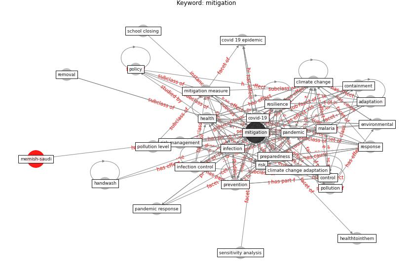

# Keyword: mitigation

* [memish-saudi](cluster_Cluster_8)

## Keywords

 * Cluster_8, action, adaptation, adaptation effort, aerosol transmission, air quality, anderson heesterbeek hollingsworth, cleaning of surface, climate adaptation, climate adaptation and mitigation, [climate change](keyword_climate_change), climate change adaptation, climate change impact, co2 emission reduction, co2 reduction, [compliance](keyword_compliance), containment, [control](keyword_control), countermeasure, covid 19 epidemic, covid 19 fight, [covid 19 pandemic](keyword_covid_19_pandemic), [covid-19](keyword_covid-19), decision maker, energy demand, environmental, environmental priority, [epidemic](keyword_epidemic), function, functional, good of mitigation measure, handwash, [health](keyword_health), healthtointhem, [human health](keyword_human_health), [inactivate](keyword_inactivate), increase in energy demand, [infection](keyword_infection), [infection control](keyword_infection_control), [light](keyword_light), live, [malaria](keyword_malaria), management of climate change impact and mitigation, mitigate, [mitigation](keyword_mitigation), mitigation and prevention strategy, mitigation function, mitigation measure, mitigation policy, mitigation strategies for uhis, mitigation strategy, moral support, [pandemic](keyword_pandemic), pandemic response, pandemicresilient, [policy](keyword_policy), pollution, pollution level, preparedness, prevent, preventing and mitigation, prevention, [public health](keyword_public_health), r0 3, removal, [resilience](keyword_resilience), response, response strategy, [risk](keyword_risk), risk assessment, risk management, risk rankingtool, school closing, sensitivity analysis, sir, sir size, [smart city](keyword_smart_city), south korea covid 19, stay at home, transmission factor β, transmission risk, urban climate adaptation, urban resiliency, [ventilation](keyword_ventilation), ventilation provision

## Concepts

 

## Neighbours

### Closest articles

* Mitigation strategies and compliance in the COVID-19 fight; how much compliance is enough? - [LINK](article_mukerjee_mitigation_2021)
* Compliance with COVID-19 Mitigation Measures in the United States - [LINK](article_van_rooij_compliance_2020)
* A Global Survey of Infection Control and Mitigation Measures for Combating the Transmission of COVID-19 Pandemic in Buildings Under Facilities Management Services - [LINK](article_sarvari_global_2022)
* The Intelligent Lockdown: Compliance with COVID-19 Mitigation Measures in the Netherlands - [LINK](article_kuiper_intelligent_2020)
* Navigating Climate Change: Rethinking the Role of Buildings - [LINK](article_cole_navigating_2020)
* COVID-19 Pandemic: Rethinking Strategies for Resilient Urban Design, Perceptions, and Planning - [LINK](article_afrin_covid-19_2021)
* Knowledge, attitudes, and practices of Indonesian residents regarding COVID-19: A national cross-sectional survey - [LINK](article_yodang_knowledge_2021)
* A review of definitions and measures of system resilience - [LINK](article_hosseini_review_2016)
* 2019 Novel Coronavirus (COVID-19) Pandemic: Built Environment Considerations To Reduce Transmission - [LINK](article_dietz_2019_2020)
* Wastewater surveillance for population-wide Covid-19: The present and future - [LINK](article_daughton_wastewater_2020)

### Closest BPs

