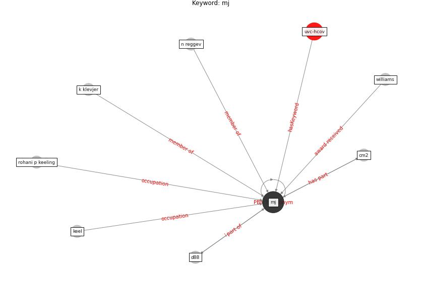

# Keyword: mj

* [uvc-hcov](cluster_Cluster_7)

## Keywords

 * Cluster_7, cm2, d88, k klevjer, keel, [mj](keyword_mj), n reggev, rohani p keeling, williams

## Concepts

 

## Neighbours

### Closest articles

* Far-UVC light (222 nm) efficiently and safely inactivates airborne human coronaviruses - [LINK](article_buonanno_far-uvc_2020)
* Mitigation strategies and compliance in the COVID-19 fight; how much compliance is enough? - [LINK](article_mukerjee_mitigation_2021)
* Compliance with COVID-19 Mitigation Measures in the United States - [LINK](article_van_rooij_compliance_2020)
* Health, Wellbeing \& Productivity in Offices - [LINK](article_world_green_building_council_health_2014)

### Closest BPs

