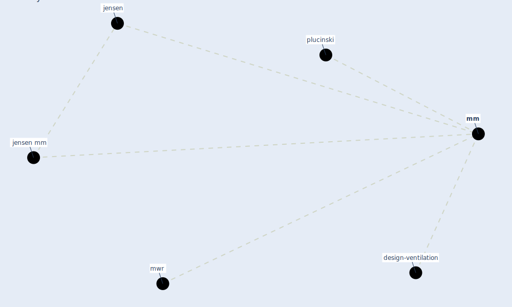

# Keyword: mm

* [design-ventilation](cluster_12)

## Keywords

 * Cluster_12, jensen, jensen mm, [mm](keyword_mm), mwr, plucinski

## Mapping

## Neighbours

### Closest articles

* Environmental factors involved in SARS-CoV-2 transmission: effect and role of indoor environmental quality in the strategy for COVID-19 infection control - [LINK](article_azuma_environmental_2020)
* Upper-room ultraviolet air disinfection might help to reduce COVID-19 transmission in buildings: a feasibility study - [LINK](article_beggs_upper-room_2020)
* Methods for air cleaning and protection of building occupants from airborne pathogens - [LINK](article_bolashikov_methods_2009)
* Management of the COVID-19 pandemic: challenges, practices, and organizational support - [LINK](article_hossny_management_2022)

### Closest BPs

