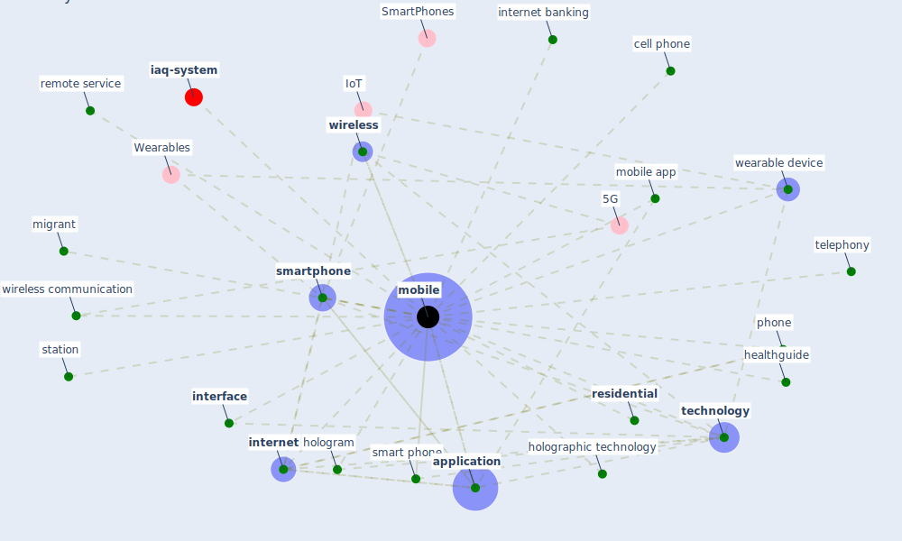

# Keyword: mobile

* [iaq-system](cluster_3)

## Keywords

 * Cluster_3, [application](keyword_application), cell phone, healthguide, hologram, holographic technology, [interface](keyword_interface), [internet](keyword_internet), internet banking, migrant, [mobile](keyword_mobile), mobile app, mobiles, phone, remote service, [residential](keyword_residential), smart phone, [smartphone](keyword_smartphone), station, [technology](keyword_technology), telephony, wearable device, [wireless](keyword_wireless), wireless communication

## Mapping

## Neighbours

### Closest articles

* How COVID-19 Could Accelerate the Adoption of New Retail Technologies and Enhance the (E-)Servicescape - [LINK](article_willems_how_2021)
* World Bank Development Report - [LINK](article_world_bank_world_2022)
* COVID-19 and the UN Sustainable Development Goals: Threat to Solidarity or an Opportunity? - [LINK](article_leal_filho_covid-19_2020)
* Mobile Technology Solution for COVID-19: Surveillance and Prevention - [LINK](article_raza_mobile_2021)
*  - [LINK](article_mehtab_alam_role_2021)
* Future (post-COVID) digital, smart and sustainable cities in the wake of 6G: Digital twins, immersive realities and new urban economies - [LINK](article_allam_future_2021)
* Leveraging Digital Transformation Technologies to Tackle COVID-19: Proposing a Privacy-First Holistic Framework - [LINK](article_arpaci_leveraging_2021)
* Digital Twin of COVID-19 Mass Vaccination Centers - [LINK](article_pilati_digital_2021)
* Continuous IEQ monitoring system: Context and development - [LINK](article_parkinson_continuous_2019)
* Assessment method for new sustainability indicators providing pandemic resilience for residential buildings - [LINK](article_tokazhanov_assessment_2021)

### Closest BPs

