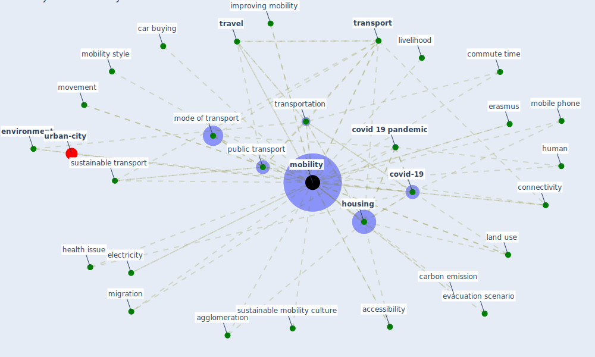

# Keyword: mobility

* [urban-city](cluster_6)

## Keywords

 * Cluster_6, accessibility, activity, agglomeration, alternative mode, autochthonous transmission, bicyclist, car buying, carbon emission, checkpoint, citizen, citizen mobility decrease, [city](keyword_city), commute time, connectivity, contagion, covid 19 impact on urban mobility, [covid 19 pandemic](keyword_covid_19_pandemic), [covid-19](keyword_covid-19), [datum](keyword_datum), disability, disease transmission, electric, electricity, [environment](keyword_environment), [epidemic](keyword_epidemic), erasmus, evacuation scenario, [globalisation](keyword_globalisation), health issue, heterogeneity, hotspot, [housing](keyword_housing), [human](keyword_human), human behavior, human movement, improving mobility, [infectious disease](keyword_infectious_disease), international, land use, leisure, leisure activity, livelihood, migration, mobile phone, mobilities, [mobility](keyword_mobility), mobility as a service, mobility choice, mobility parameter, mobility pattern, mobility style, mode of transport, movement, movement of good, multimodality, new restriction, occupant behaviour, occupation, occupation model, origin destination density, [pandemic](keyword_pandemic), parameter, [pedestrian](keyword_pedestrian), population health, post pandemic mobility, post-pandemic, postcovid transport policy, probability of visit the hospital, public mode of transport, [public place](keyword_public_place), [public transport](keyword_public_transport), [responsible transport](keyword_responsible_transport), [restriction](keyword_restriction), scale of change in mobility behaviour due to the epidemic, share ride, smartphone, [space](keyword_space), stratification, [sustainable development](keyword_sustainable_development), sustainable mobility culture, sustainable transport, testing, testing availability, transition, [transport](keyword_transport), transportation, transportation mobility, [travel](keyword_travel), travel behavior, travel mode, urban green space distribution, urban growth, urban movement, urbanization, work from home, α 6

## Mapping

## Neighbours

### Closest articles

* Mobility Behaviour in View of the Impact of the COVID-19 Pandemic—Public Transport Users in Gdansk Case Study - [LINK](article_przybylowski_mobility_2021)
* Respiratory pandemics, urban planning and design: A multidisciplinary rapid review of the literature - [LINK](article_harris_respiratory_2022)
* Urban design attributes and resilience: COVID-19 evidence from New York City - [LINK](article_yang_urban_2021)
* COVID-19 Could Leverage a Sustainable Built Environment - [LINK](article_pinheiro_covid-19_2020)
* Responsible Transport: A post-COVID agenda for transport policy and practice - [LINK](article_budd_responsible_2020)
* Understanding the role of urban design in disease spreading - [LINK](article_brizuela_understanding_2019)
* Urban planning after COVID-19 - [LINK](article_rtpi_urban_2021)
* The COVID-19 pandemic: Impacts on cities and major lessons for urban planning, design, and management - [LINK](article_sharifi_covid-19_2020)
* Integrating rapid risk mapping and mobile phone call record data for strategic malaria elimination planning - [LINK](article_tatem_integrating_2014)
* The Socio-Spatial Determinants of COVID-19 Diffusion: The Impact of Globalisation, Settlement Characteristics and Population - [LINK](article_sigler_socio-spatial_2020)

### Closest BPs

