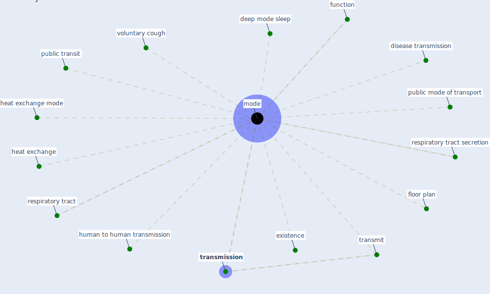

# Keyword: mode

## Keywords

 * deep mode sleep, disease transmission, existence, floor plan, function, heat exchange, heat exchange mode, human to human transmission, [mode](keyword_mode), modes, public mode of transport, public transit, respiratory tract, respiratory tract secretion, [transmission](keyword_transmission), transmit, voluntary cough

## Mapping

## Neighbours

### Closest articles

* COVID-19 and its Modes of Transmission - [LINK](article_karia_covid-19_2020)
* Prophylactic Architecture: Formulating the Concept of Pandemic-Resilient Homes - [LINK](article_elrayies_prophylactic_2022)
* COVID-19 as a Harbinger of Transforming Infrastructure Resilience - [LINK](article_carvalhaes_covid-19_2020)
* Review and comparison of HVAC operation guidelines in different countries during the COVID-19 pandemic - [LINK](article_guo_review_2021)
* Environmental factors involved in SARS-CoV-2 transmission: effect and role of indoor environmental quality in the strategy for COVID-19 infection control - [LINK](article_azuma_environmental_2020)
* ASHRAE Position Document on Infectious Aerosols - [LINK](article_ashrae_ashrae_2022)
* Responsible Transport: A post-COVID agenda for transport policy and practice - [LINK](article_budd_responsible_2020)
* Scalable IoT Architecture for Monitoring IEQ Conditions in Public and Private Buildings - [LINK](article_calvo_scalable_2022)
* Ventilation use in nonmedical settings during COVID-19: Cleaning protocol, maintenance, and recommendations - [LINK](article_nembhard_ventilation_2020)
* Urban planning after COVID-19 - [LINK](article_rtpi_urban_2021)

### Closest BPs

