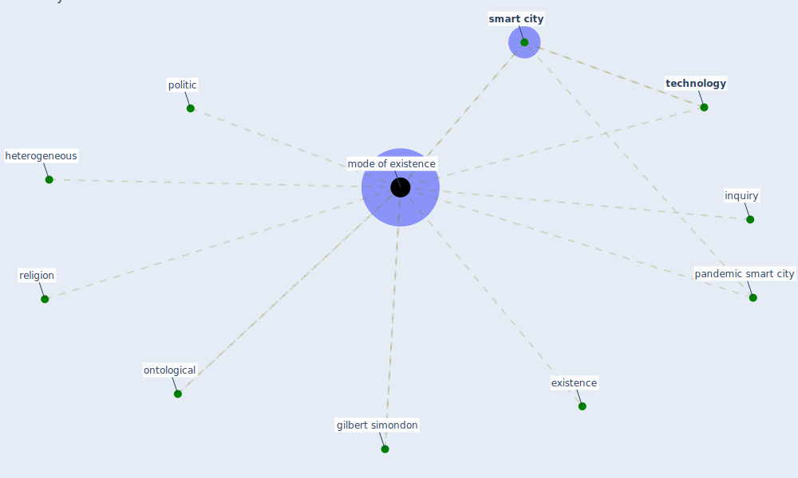

# Keyword: mode of existence

## Keywords

 * existence, gilbert simondon, heterogeneous, inquiry, [mode of existence](keyword_mode_of_existence), modes of existence, ontological, pandemic smart city, politic, religion, [smart city](keyword_smart_city), [technology](keyword_technology)

## Mapping

## Neighbours

### Closest articles

* The three modes of existence of the pandemic smart city - [LINK](article_soderstrom_three_2021)
* Contributions of Smart City Solutions and Technologies to Resilience against the COVID-19 Pandemic: A Literature Review - [LINK](article_sharifi_contributions_2021)

### Closest BPs

