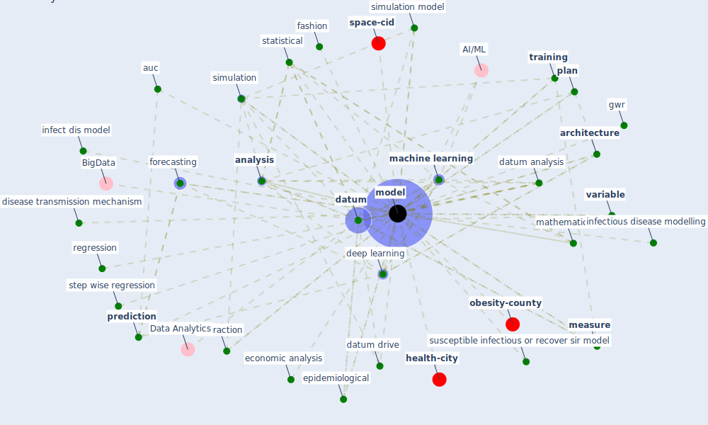

# Keyword: model

* [health-city](cluster_1)

* [space-cid](cluster_2)

* [obesity-county](cluster_9)

## Keywords

 * 95 confidence interval, agent base model, alternative specification, [analysis](keyword_analysis), analytical, [architecture](keyword_architecture), auc, battle covid 19, behaviour, [big datum](keyword_big_datum), big datum analytic, [build](keyword_build), building design, classification algorithm, code, correlate regression, [covid-19](keyword_covid-19), crowd movement, data quality and consideration for model, [datum](keyword_datum), datum analysis, datum analytic, datum drive, [deep learning](keyword_deep_learning), dependent variable, [detection](keyword_detection), discrete event simulation, disease transmission mechanism, domain knowledge, econometric, economic analysis, economic modelling, [epidemiological](keyword_epidemiological), eq 9, experiment, fashion, forecast, forecasting, function, fusion of knowledge, generalized linear regression, geographically weight regression, graph representation, gwr, health belief model, health care expenditure and use, heuristic, human building interaction, [industry](keyword_industry), infect dis model, infectious disease dynamic, infectious disease modelling, insight, [interaction](keyword_interaction), key strategic alignment component, lagrangian system, land use analysis, linear model, [machine learning](keyword_machine_learning), [mapping](keyword_mapping), mathematical, [measure](keyword_measure), [method](keyword_method), microscopic crowd model, [model](keyword_model), model 2, model base analysis, model be significantly distinct, model development, model study, occupancy model, optimization model, output parameter, overfitte, [parameter](keyword_parameter), [plan](keyword_plan), [prediction](keyword_prediction), prediction model, predictor, probability, regression, relative good fit, resilient housing, simul, simulate, [simulation](keyword_simulation), [simulation model](keyword_simulation_model), society of agent, statistical, step wise regression, [study](keyword_study), susceptible infectious or recover sir model, train, [training](keyword_training), trans acm, typologie, unadjuste, [variable](keyword_variable), walker, wrrf

## Mapping

## Neighbours

### Closest articles

* EXPOSED: An occupant exposure model for confined spaces to retrofit crowd models during a pandemic - [LINK](article_ronchi_exposed_2020)
* A review of definitions and measures of system resilience - [LINK](article_hosseini_review_2016)
* A Comprehensive Review of the COVID-19 Pandemic and the Role of IoT, Drones, AI, Blockchain, and 5G in Managing its Impact - [LINK](article_chamola_comprehensive_2020)
* COVID-ABS: An agent-based model of COVID-19 epidemic to simulate health and economic effects of social distancing interventions - [LINK](article_silva_covid-abs_2020)
* COVID-19 and regional solutions for mitigating the risk of SME finance in selected ASEAN member states - [LINK](article_taghizadeh-hesary_covid-19_2022)
* Digital Twin of COVID-19 Mass Vaccination Centers - [LINK](article_pilati_digital_2021)
* Designing a Multi-Agent Occupant Simulation System to Support Facility Planning and Analysis for COVID-19 - [LINK](article_lee_designing_2021)
* The Socio-Spatial Determinants of COVID-19 Diffusion: The Impact of Globalisation, Settlement Characteristics and Population - [LINK](article_sigler_socio-spatial_2020)
* COVID19-Routes: A Safe Pedestrian Navigation Service - [LINK](article_cantarero_covid19-routes_2021)
* Association of built environment attributes with the spread of COVID-19 at its initial stage in China - [LINK](article_li_association_2021)

### Closest BPs

