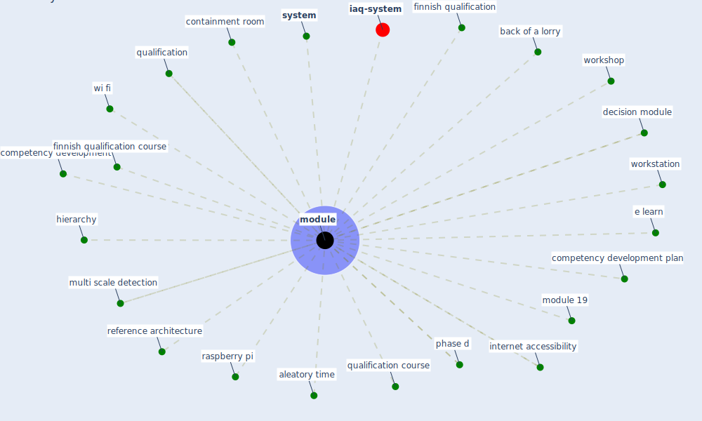

# Keyword: module

* [iaq-system](cluster_3)

## Keywords

 * Cluster_3, aleatory time, back of a lorry, competency development, competency development plan, containment room, decision module, e learn, finnish qualification, finnish qualification course, hierarchy, internet accessibility, [module](keyword_module), module 19, modules, multi scale detection, phase d, qualification, qualification course, raspberry pi, reference architecture, [system](keyword_system), [wi fi](keyword_wi_fi), workshop, [workstation](keyword_workstation)

## Mapping

## Neighbours

### Closest articles

* Case Study on Finnish TVETA Resilient Model of Training During COVID-19 - [LINK](article_unesco_case_2021)
* Digital Twin of COVID-19 Mass Vaccination Centers - [LINK](article_pilati_digital_2021)
* A comprehensive review on indoor air quality monitoring systems for enhanced public health - [LINK](article_saini_comprehensive_2020)
* Guidelines for resilience systems analysis - [LINK](article_oecd_guidelines_2014)
* An Overview of Ontologies and Tool Support for COVID-19 Analytics - [LINK](article_ahmad_overview_2021)
* An Intelligent IEQ Monitoring and Feedback System: Development and Applications - [LINK](article_geng_intelligent_2021)
* DeepSOCIAL: Social Distancing Monitoring and Infection Risk Assessment in COVID-19 Pandemic - [LINK](article_rezaei_deepsocial_2020)
* The effect of a redesigned floor plan, occupant density and the quality of indoor climate on the cost of space, productivity and sick leave in an office building–A case study - [LINK](article_saari_effect_2006)
* DfMA for rapid adaptive resilience and flexible infrastructure - [LINK](article_mott_macdonald_dfma_2020)

### Closest BPs

