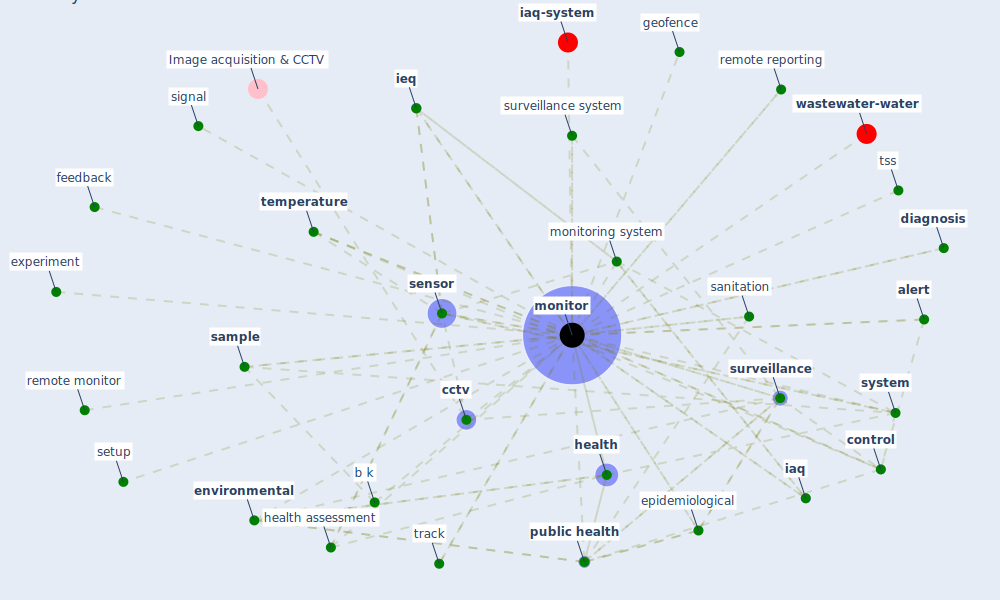

# Keyword: monitor

* [wastewater-water](cluster_0)

* [iaq-system](cluster_3)

## Keywords

 * Cluster_0, Cluster_3, [alert](keyword_alert), [analysis](keyword_analysis), analysis of datum, awareness, b k, [camera](keyword_camera), [cctv](keyword_cctv), cdc guideline, community surveillance, [compliance](keyword_compliance), [computer vision](keyword_computer_vision), [control](keyword_control), [covid 19 pandemic](keyword_covid_19_pandemic), [covid-19](keyword_covid-19), cyber physical, daily, data collection interval, datum aggregation, demand control ventilation system, [device](keyword_device), [diagnosis](keyword_diagnosis), diagnostic testing, disease outbreak, [disinfect](keyword_disinfect), [environmental](keyword_environmental), [epidemiological](keyword_epidemiological), experiment, feedback, foobot, forecasting, geofence, [health](keyword_health), health assessment, heart rate, [iaq](keyword_iaq), [ieq](keyword_ieq), image recognition, [infectious disease](keyword_infectious_disease), installation, [internet](keyword_internet), [iot](keyword_iot), iq, meta capability, microgrid, [monitor](keyword_monitor), monitoring station, monitoring system, multiparametric, noise level, peer group analysis, power consumption, prediction system, predictor, [public health](keyword_public_health), public health surveillance, [quarantine](keyword_quarantine), record keeping, regional, [remote](keyword_remote), remote monitor, remote reporting, [research](keyword_research), research activity, [sample](keyword_sample), sample test, [sanitation](keyword_sanitation), [sensor](keyword_sensor), sensor network, service firm, setup, sewage surveillance, signal, [surveillance](keyword_surveillance), surveillance system, [survey](keyword_survey), [sustainable](keyword_sustainable), [sustainable work](keyword_sustainable_work), [system](keyword_system), system monitor, [telemedicine](keyword_telemedicine), telenurse, [temperature](keyword_temperature), temperature monitoring, [test](keyword_test), tobacco use, [trace](keyword_trace), track, treat, [treatment](keyword_treatment), tss, [uav](keyword_uav), urban dynamic, urban wastewater, validation, [wastewater](keyword_wastewater), wastewater analysis, wireless sensor, wsn

## Mapping

## Neighbours

### Closest articles

* Scalable IoT Architecture for Monitoring IEQ Conditions in Public and Private Buildings - [LINK](article_calvo_scalable_2022)
* A comprehensive review on indoor air quality monitoring systems for enhanced public health - [LINK](article_saini_comprehensive_2020)
* An Intelligent IEQ Monitoring and Feedback System: Development and Applications - [LINK](article_geng_intelligent_2021)
* The Effect of Opening Windows on Air Change Rates in Two Homes - [LINK](article_howard-reed_effect_2002)
* Impact of COVID-19 on IoT Adoption in Healthcare, Smart Homes, Smart Buildings, Smart Cities, Transportation and Industrial IoT - [LINK](article_umair_impact_2021)
* The Smart City and Covid‐19 - [LINK](article_webb_smart_2020)
* Towards the sustainable development of smart cities through mass video surveillance: A response to the COVID-19 pandemic - [LINK](article_shorfuzzaman_towards_2021)
* How COVID-19 Could Accelerate the Adoption of New Retail Technologies and Enhance the (E-)Servicescape - [LINK](article_willems_how_2021)
* Wastewater surveillance for population-wide Covid-19: The present and future - [LINK](article_daughton_wastewater_2020)
* Future perspectives of wastewater-based epidemiology: Monitoring infectious disease spread and resistance to the community level - [LINK](article_sims_future_2020)

### Closest BPs

