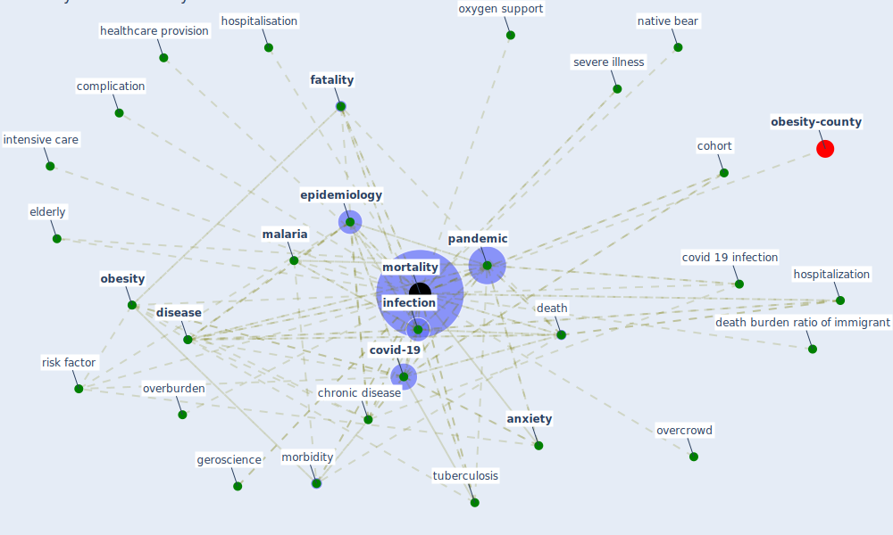

# Keyword: mortality

* [obesity-county](cluster_9)

## Keywords

 * Cluster_9, [air pollution](keyword_air_pollution), air quality, all cause, all cause mortality, [anxiety](keyword_anxiety), asymptomatic, asymptomatic case, [chronic disease](keyword_chronic_disease), [cohort](keyword_cohort), complication, covid 19 infection, covid 19 virus, covid infection, [covid-19](keyword_covid-19), death, death burden ratio, death burden ratio of immigrant, death rate, [density](keyword_density), deprivation, [disease](keyword_disease), disease progression, elderly, elderly community population, [epidemiology](keyword_epidemiology), [eviction moratoria](keyword_eviction_moratoria), [fatality](keyword_fatality), [germany](keyword_germany), geroscience, healthcare provision, healthsystem, heat related morbidity, heat wave, high efficiency particulate air filtration, high level of air pollution, hospitalisation, hospitalization, illness, [infection](keyword_infection), [influenza](keyword_influenza), intensive care, intermarriage, [malaria](keyword_malaria), [meta analysis](keyword_meta_analysis), morbidity, mortalities, [mortality](keyword_mortality), [native bear](keyword_native_bear), [obesity](keyword_obesity), obesogenic, overburden, overcrowd, overcrowd in nursing home, oxygen support, [pandemic](keyword_pandemic), particulate air filtration, poor air quality, public health concern, relative risk, [risk](keyword_risk), risk factor, severe illness, severity index, significant, smoking status, [spread](keyword_spread), [tuberculosis](keyword_tuberculosis), urban greenspace, violence

## Mapping

## Neighbours

### Closest articles

* Treating two pandemics for the price of one: Chronic and infectious disease impacts of the built and natural environment - [LINK](article_frank_treating_2021)
* COVID-19 Higher Mortality in Chinese Regions With Chronic Exposure to Lower Air Quality - [LINK](article_pansini_covid-19_2021)
* What has been the impact of the COVID-19 pandemic on immigrants? An update on recent evidence - [LINK](article_oecd_what_2022)
* The impact of COVID-19 and strategies for mitigation and suppression in low- and middle-income countries - [LINK](article_walker_impact_2020)
* Association of built environment attributes with the spread of COVID-19 at its initial stage in China - [LINK](article_li_association_2021)
* Urban Green Infrastructure and Green Open Spaces: An Issue of Social Fairness in Times of COVID-19 Crisis - [LINK](article_reinwald_urban_2021)
* The Role of Architecture and Urbanism in Preventing Pandemics - [LINK](article_kumar_role_2021)
* Eviction, Health Inequity, and the Spread of COVID-19: Housing Policy as a Primary Pandemic Mitigation Strategy - [LINK](article_benfer_eviction_2021)
* A comprehensive review on indoor air quality monitoring systems for enhanced public health - [LINK](article_saini_comprehensive_2020)
* The socio-economic determinants of COVID-19: A spatial analysis of German county level data - [LINK](article_ehlert_socio-economic_2021)

### Closest BPs

