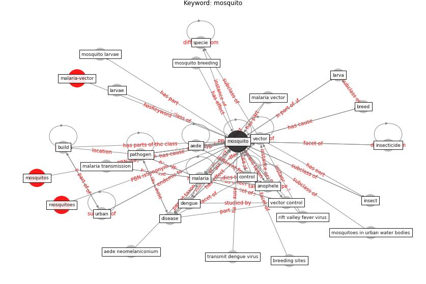

# Keyword: mosquito

* [malaria-vector](cluster_Cluster_12)

## Keywords

 * Cluster_12, aede, aede genus, aede neomelaniconium, aedes vector, albopictus, anophele, breed, breeding sites, [build](keyword_build), container bred, [control](keyword_control), culex pipiens complex, [dengue](keyword_dengue), dengue virus, diptera, [disease](keyword_disease), disease vector, disease vectors, duck pond, entomology, [infectious disease](keyword_infectious_disease), insect, insecticide, insecticides, larva, larvae, [malaria](keyword_malaria), malaria mitigation, malaria transmission, malaria vector, [mosquito](keyword_mosquito), mosquito breeding, mosquito larvae, mosquitoes, mosquitoes in urban water bodies, mosquitos, [pathogen](keyword_pathogen), rift valley fever virus, specie, transmit dengue virus, [urban](keyword_urban), [vector](keyword_vector), vector control, viral disease, wolbachia

## Concepts

 

## Neighbours

### Closest articles

* Decision Making within the Built Environment as a Strategy for Mitigating the Risk of Malaria and Other Vector-Borne Diseases - [LINK](article_obonyo_decision_2018)
* Challenges to Mitigating the Urban Health Burden of Mosquito-Borne Diseases in the Face of Climate Change - [LINK](article_ligsay_challenges_2021)
* Making green infrastructure healthier infrastructure - [LINK](article_lohmus_making_2015)
* Addressing vulnerability, building resilience: community-based adaptation to vector-borne diseases in the context of global change - [LINK](article_bardosh_addressing_2017)
* The impact of climate change on the epidemiology and control of Rift Valley fever - PubMed - [LINK](article_martin_impact_2008)
* Prototype Early Warning Systems for Vector-Borne Diseases in Europe - [LINK](article_semenza_prototype_2015)
* Vector-borne disease, climate change and urban design - [LINK](article_ogden_vector-borne_2016)
* Global policy challenges for urban vector-borne disease risks - [LINK](article_alabaster_global_2016)
* An Overview of Biomedical Ontologies for Pandemics and Infectious Diseases Representation - [LINK](article_bayoudhi_overview_2021)
* Learning from pandemics: Applying resilience thinking to identify priorities for planning urban settlements - [LINK](article_syal_learning_2021)

### Closest BPs

