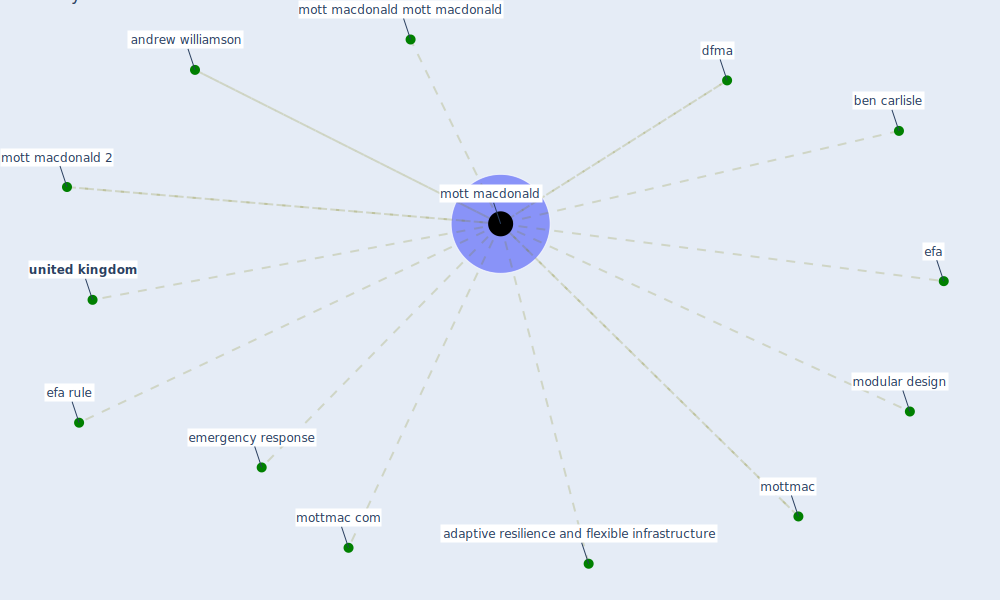

# Keyword: mott macdonald

## Keywords

 * adaptive resilience and flexible infrastructure, andrew williamson, ben carlisle, [dfma](keyword_dfma), efa, efa rule, emergency response, modular design, [mott macdonald](keyword_mott_macdonald), mott macdonald 2, mott macdonald mott macdonald, [mottmac](keyword_mottmac), mottmac com, [united kingdom](keyword_united_kingdom)

## Mapping

## Neighbours

### Closest articles

* DfMA for rapid adaptive resilience and flexible infrastructure - [LINK](article_mott_macdonald_dfma_2020)

### Closest BPs

