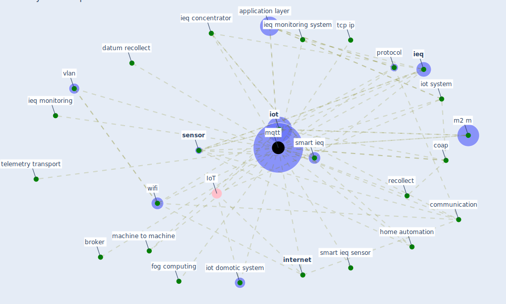

# Keyword: mqtt

## Keywords

 * application layer, broker, coap, communication, datum recollect, fog computing, home automation, [ieq](keyword_ieq), ieq concentrator, ieq monitoring, ieq monitoring system, [internet](keyword_internet), [iot](keyword_iot), iot domotic system, iot system, m2 m, machine to machine, [mqtt](keyword_mqtt), [protocol](keyword_protocol), recollect, [sensor](keyword_sensor), [smart ieq](keyword_smart_ieq), smart ieq sensor, tcp ip, telemetry transport, vlan, [wifi](keyword_wifi)

## Mapping

## Neighbours

### Closest articles

* Scalable IoT Architecture for Monitoring IEQ Conditions in Public and Private Buildings - [LINK](article_calvo_scalable_2022)

### Closest BPs

