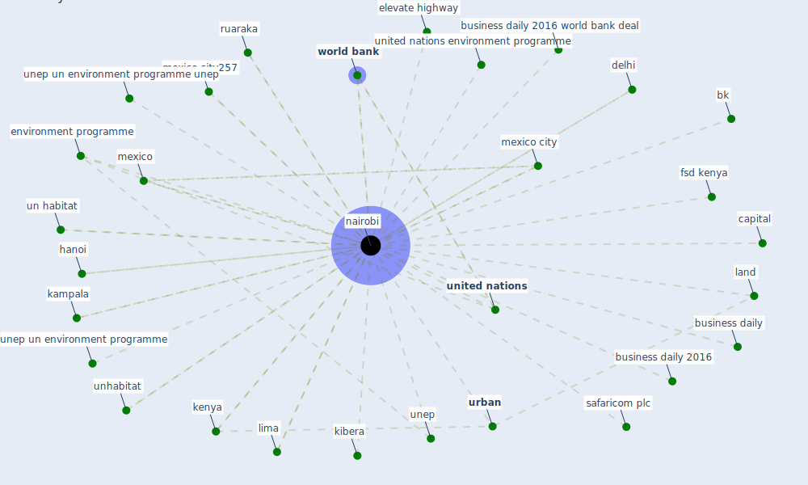

# Keyword: nairobi

## Keywords

 * biodiversity framework, bk, business daily, business daily 2016, business daily 2016 world bank deal, capital, delhi, elevate highway, environment programme, first elevate highway, fsd kenya, hanoi, ict, ict drive, ict drive plan and infrastructure, kampala, [kenya](keyword_kenya), kenya school of monetary study, kibera, land, lima, metropolis, mexico, mexico city, mexico city257, [nairobi](keyword_nairobi), periurban, periurban area, ruaraka, safaricom plc, un habitat, unep, unep un environment programme, unep un environment programme unep, unhabitat, [united nations](keyword_united_nations), united nations environment programme, [urban](keyword_urban), [world bank](keyword_world_bank)

## Mapping

## Neighbours

### Closest articles

* Urban planning after COVID-19 - [LINK](article_rtpi_urban_2021)
* World Bank Development Report - [LINK](article_world_bank_world_2022)
* Integrating rapid risk mapping and mobile phone call record data for strategic malaria elimination planning - [LINK](article_tatem_integrating_2014)
* Future (post-COVID) digital, smart and sustainable cities in the wake of 6G: Digital twins, immersive realities and new urban economies - [LINK](article_allam_future_2021)
* Building up an ecologically sustainable and socially desirable post-COVID-19 future - [LINK](article_duflot_building_2021)
* Prophylactic Architecture: Formulating the Concept of Pandemic-Resilient Homes - [LINK](article_elrayies_prophylactic_2022)
* The Role of Architecture and Urbanism in Preventing Pandemics - [LINK](article_kumar_role_2021)

### Closest BPs

